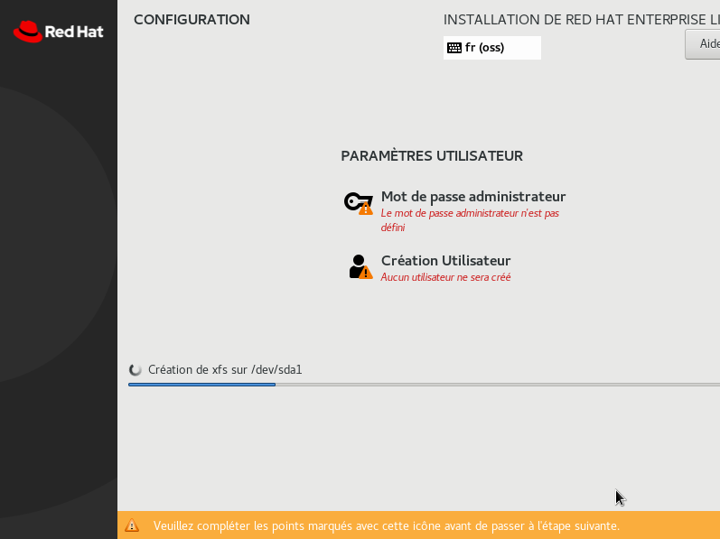
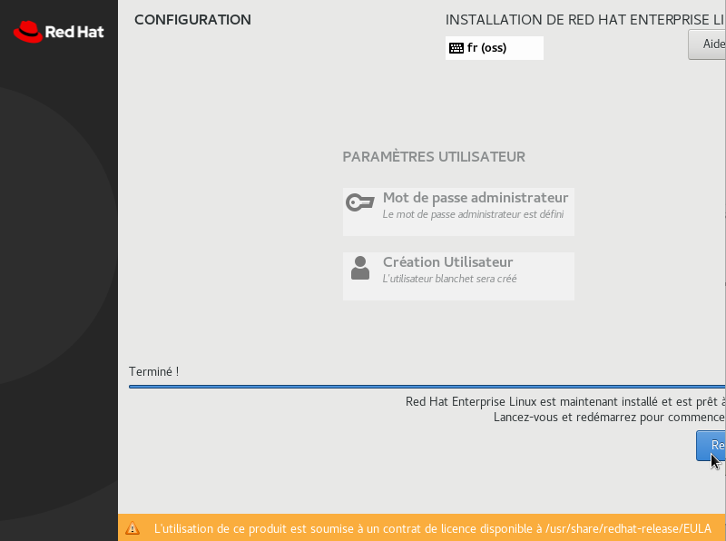

#	Principes de base

Ce guide vise à rendre un système Red Hat plus résilient face aux attaques informatiques, ce qu'on appelle un système durci. Il se base principalement sur les recommandations [CIS] et [ANSSI].

Ce guide décrit la procédure à suivre pour un système Red Hat Linux Entreprise 8.1, 8.2 ou 8.3.

Si ce guide n’a pas été suivi dès l’installation du système, il sera compliqué voire très fastidieux de mettre en place l’ensemble des règles définies dans ce guide.

##	Installation
Certains des paramètres de sécurisation sont uniquement ou plus facilement sélectionnables lors de l’installation. Ce sont, en particulier, la répartition des partitions et la sélection initiale de logiciels à installer. 

L’installation du système est décrite au [chapitre ci-dessous](#installation-du-système).

La documentation constructeur est disponible sur [le site Red Hat](https://access.redhat.com/documentation/fr-fr/red_hat_enterprise_linux/8/html-single/performing_a_standard_rhel_installation/index).

Pour rappel, pendant l’installation et avant l’installation des correctifs de sécurité, l’ordinateur est potentiellement vulnérable et doit donc être déconnecté ou au pire connecté à un réseau maitrisé.

##	Application automatique
Quand cela est possible, les règles de sécurisation ont été traduites dans un script qui permet d’appliquer les paramètres demandés sans interaction de l’utilisateur.

##	Finalisation de la sécurisation
Un certain nombre d’opérations (trop complexes ou dépendantes du réseau d’installation) sont à réaliser manuellement, et sont décrites dans le chapitre [dédié](#opérationsmanuelles).

##	Audit
L’audit permet de s’assurer que le système est correctement configuré. Il est à réaliser à intervalles réguliers pour s’assurer qu’il n’y a pas de déviations ou de dérives du système. Par exemple, des mises à jour du système peuvent modifier des permissions sur le système de fichiers.

L’audit est décrit au [chapitre dédié](#audit-1).

#	Installation du système

##	Sur une machine virtuelle
Il est conseillé de s’assurer que le matériel virtualisé soit réduit au minimum : par exemple pas de carte son, pas de port série … pour limiter la surface d’attaque.
Le disque dur alloué doit être au minimum de 48 Go

##	Depuis une image ISO
 
Démarrer le système depuis l’image ISO, puis dès que l’installateur graphique est démarré, sélectionner France, Français(France) comme paramètres linguistiques. S’assurer que le clavier est positionné à fr(oss) après avoir cliqué sur Continuer.


Depuis l’écran Résumé de l’installation, positionner la Sélection Logiciel à « Installation minimale » :


Depuis l’écran Résumé de l’installation, positionner le paramètre KDUMP à désactivé :
 


Depuis l’écran Résumé de l’installation, cliquer sur « Nom du réseau &…» pour activer la carte réseau et modifier les différents paramètres réseau (dont le nom DNS). 


 
Depuis l’écran principal, régler l’heure & date pour pointer vers le fuseau horaire cible et si disponible, définir une ou plusieurs sources NTP fiables.
Depuis l’écran Résumé de l’installation, pour le partitionnement du disque dur, choisissez ‘Personnalisé’ (cliquer sur Fait) puis garder les options par défaut pour le disque (LVM) et cliquer sur + pour créer les partitions suivantes :


Point de montage | Taille Minimum
--|--
/	| 4 Gio
/boot	| 1 Gio
/boot/efi	| 512 Mio
/usr	| 12 Gio
/tmp	| 1 Gio
/home	| 2 Gio
/var	| 4 Gio
/var/log	| 4 Gio
/var/tmp	| 4 Gio
/var/log/audit	| 4 Gio
/srv ou /opt	| 6 Gio
swap	| 4 Gio (ou 20% de la mémoire vive) 

Ne pas sélectionner de politique de sécurité.
Le chapitre But du système est optionnel et pour information seulement.
Cliquer sur Commencer l’installation.
 
Définir un mot de passe administrateur (root) et créer un compte utilisateur. Veiller à choisir des mots de passe conformes à la politique de sécurité.



Redémarrer une fois l’installation terminée :
 


Passer ensuite à la sécurisation dans le chapitre ci-dessous : [Sécurisation](#sécurisation-1).

#	Sécurisation

Une fois l’installation terminée selon le chapitre précédent, la sécurisation proprement dite se passe en quatre étapes :

1. Effectuer les opérations manuelles détaillés ci-dessous.
1. Lancer le script fourni en attachement puis rédémarrer.
1. Appliquer les correctifs et mises à jour de sécurité.
1. Mettre en place les mesures organisationnelles de suivi (procédures de MCS, liste des utilisateurs, liste des services ...)

##	Opérations Manuelles
Editer le fichier /etc/fstab pour rajouter les options sur les points de montage suivant le tableau suivant :

Point de Montage | Options | Description
--|--|--
/	| *pas d'option* |Partition racine, contient le reste de l’arborescence
/boot et /boot/efi	|nodev,nosuid,noexec,noauto	|Contient le noyau et le chargeur de démarrage. Pas d’accès nécessaire une fois le boot terminé (sauf mise à jour)
/dev/shm	|nodev,nosuid,noexec	|Contient les segments de mémoire partagés
/home	|nodev,nosuid,noexec	|Contient les HOME utilisateurs. Montage en lecture seule si non utilisé
/opt	|nosuid,nodev (ro optionnel)	|Packages additionnels au système. Montage en lecture seule si non utilisé
/proc	|hidepid=2,gid=sudogrp	|Contient des informations sur les processus et le système
/srv ou /opt	|nosuid,nodev (noexec,ro optionnels)	|Contient des fichiers servis par un service type web, ftp, etc.
/tmp	|nodev,nosuid,noexec	|Fichiers temporaires. Ne doit contenir que des éléments non exécutables. Nettoyé après redémarrage ou préférablement de type tmpfs
/usr	|nodev (ro optionnel)	|Contient la majorité des utilitaires et fichiers système
/var	|nodev,nosuid,noexec	|Partition contenant des fichiers variables pendant la vie du système (mails, fichiers PID, bases de données d’un service)
/var/log	|nodev,nosuid,noexec	|Contient les logs du système
/var/log/audit	|nodev,nosuid,noexec	|Contient les logs d'audit du système
/var/tmp	|nodev,nosuid,noexec	|Fichiers temporaires conservés après extinction

Rajouter les lignes suivantes :
~~~
proc	/proc		proc	rw,nosuid,nodev,noexec,relatime,hidepid=2,gid=sudoers	0 0
none	/dev/shm	tmpfs	nosuid,nodev,noexec,defaults					        0 0
~~~

À titre d’exemple, voici le fichier édité pour une machine virtuelle (sans les options « ro » de lecture seule) :
```
#
# /etc/fstab
# Created by anaconda on Fri Sep 11 11:21:06 2020
#
# Accessible filesystems, by reference, are maintained under '/dev/disk/'.
# See man pages fstab(5), findfs(8), mount(8) and/or blkid(8) for more info.
#
# After editing this file, run 'systemctl daemon-reload' to update systemd
# units generated from this file.
#
/dev/mapper/rhel_lab-root			/                    	xfs   	defaults						0 0
UUID=3fe99bee-938f-4751-a956-b4335bc32e7c 	/boot           xfs   	nosuid,nodev,noexec,noauto,defaults        		0 0
UUID=16FD-1FB3          			/boot/efi    		    vfat  	nosuid,nodev,noexec,noauto,umask=0077,shortname=winnt 	0 2
/dev/mapper/rhel_lab-home 			/home       		    xfs   	nosuid,nodev,noexec,defaults        			0 0
/dev/mapper/rhel_lab-srv 			/srv      		        xfs  	nosuid,nodev,defaults        				0 0
/dev/mapper/rhel_lab-tmp 			/tmp           	        xfs   	nosuid,nodev,noexec,defaults        			0 0
/dev/mapper/rhel_lab-usr 			/usr              	    xfs   	nodev,defaults        					0 0
/dev/mapper/rhel_lab-var 			/var          		    xfs   	nosuid,nodev,noexec,defaults        			0 0
/dev/mapper/rhel_lab-var_log 			/var/log     		xfs   	nosuid,nodev,noexec,defaults        			0 0
/dev/mapper/rhel_lab-var_log_audit 		/var/log/audit  	xfs   	nosuid,nodev,noexec,defaults        			0 0
/dev/mapper/rhel_lab-var_tmp	   		/var/tmp        	xfs   	nosuid,nodev,noexec,defaults        			0 0
/dev/mapper/rhel_lab-swap 	   		swap                 	swap  	defaults        					0 0
proc    			   		        /proc    		        proc  	rw,nosuid,nodev,noexec,relatime,hidepid=2,gid=sudogrp	0 0
none      			   		        /dev/shm        	    tmpfs 	nosuid,nodev,noexec,defaults				0 0
```
## 	Lancer le script de sécurisation
Copier le script fourni en attachement dans le répertoire /root, puis le lancer dans une session root (ou dans une session sudo). Il est obligatoire d’avoir inséré un DVD d’installation dans le lecteur (ou à défaut d’avoir monté l’image ISO sur le répertoire /mnt/disc). Une fois lancé, le script pose quelques questions pour affiner le paramétrage.
Une fois la sécurisation effectuée (et le système redémarré), il n’est plus possible de relancer le script : le montage des images ISO n’étant plus possible. Voir le chapitre [Utiliser le système](#clés-usb) pour les procédures à appliquer pour utiliser des supports externes.

##	Correctifs
Pour rappel, il est évidemment nécessaire d’installer au plus tôt les dernières mises à jour de sécurité.

En plus des mises à jour de sécurité, des correctifs fonctionnels peuvent être nécessaires pour résoudre des défauts logiciels ou améliorer le fonctionnement du système. 

Il est donc fortement recommandé qu'un processus de veille soit mise en place pour identifier au plus tôt les correctifs indispensables au maitien en condition de sécurité (MCS) ou nécessaires au bon fonctionnement du système (MCO).

#	Documents à établir
La directive HARDE-RHEL-51 demande à ce qu’une liste blanche des démons (services résidents) soit établie.

La directive HARDE-RHEL-143 demande à ce qu’une liste blanche et une liste noire des utilisateurs soient établies.

#	Audit	
Le catalogue des règles de sécurisation donne le détail des étapes à réaliser pour auditer le système. Comme pour la sécurisation, lorsque cela a été possible, ces étapes ont été automatisées à l’aide d’un script harde.sh fourni en attachement. Ce script a été écrit en utilisant le framework bats-core (également fourni en attachement).

# CATALOGUE DES REGLES DE SECURISATION
Ce catalogue contient des règles définies à partir des recommandations [ANSSI] et du benchmark [CIS].
Certaines de ces règles sont positionnées à « Ne pas implémenter » car elles ont été jugées non pertinentes ou non applicables dans le cadre de ce projet. Elles sont néanmoins présentes pour offrir une vision globale des recommandations.
La majorité de ces règles sont mis en place par un paramétrage du système mais certaines demandent la mise en place de procédures organisationnelles.

[ANSSI]: https://www.ssi.gouv.fr/entreprise/guide/recommandations-de-securite-relatives-a-un-systeme-gnulinux/ (Recommandations de configuration d’un système GNU/Linux - v1.2)

[CIS]: https://www.cisecurity.org/benchmark/red_hat_linux/ (Securing Red Hat Linux 8)
## HARDE-RHEL-001 : Minimisation des services installés

### Description

Supprimer les services non nécessaires. Une liste de paquets le plus souvent inutiles et désinstallée par le script de sécurisation. 

#### Références

#### CIS
Références:
Contrôles:

#### ANSSI
Référence ANSSI: R1

#### Niveau de Durcissement: 1

### Méthode à suivre

Pour implémenter cette règle, utiliser le script fourni, dont voici un extrait du code source concernant HARDE-RHEL-001 :
``` {.bash .numberLines}
#! /bin/bash
echo "HARDE-RHEL-1 : Minimisation des services installés"
# If we're online update
dnf update
# packages that we depends on
dnf install --assumeyes net-tools tar policycoreutils-python-utils \
  setools-console chrony rsyslog bzip2 firewalld audit usbguard rng-tools \
  openscap-scanner libcap-ng-utils aide rsyslog rsyslog-gnutls \
  audispd-plugins tmux dnf-automatic sssd-ipa sudo policycoreutils \
  python3-subscription-manager-rhsm fapolicyd aide scap-security-guide sssd \
  realmd oddjob oddjob-mkhomedir adcli samba-common samba-common-tools \
  krb5-workstation openldap-clients python3-policycoreutils
dnf remove --assumeyes abrt-addon-ccpp abrt-plugin-sosreport iprutils nfs-utils \
  abrt-addon-python tuned abrt-addon-kerneloops gssproxy abrt-plugin-logger \
  abrt-cli abrt-plugin-rhtsupport sendmail abrt setroubleshoot \
  setroubleshoot-server mcstrans xinetd xorg-x11*.* ypbind telnet
# Fin: HARDE-RHEL-1
```

#### Méthode d'audit

```bash
ps aux
netstat -tulpen
ss -xp
```
## HARDE-RHEL-002 : Minimisation de la configuration

### Description
Les fonctionnalités configurées au niveau des services démarrés doivent être limitées
au strict nécessaire.
### Références

#### CIS
Références: N/A
Contrôles: N/A

#### ANSSI
Référence ANSSI: R2

#### Niveau de Durcissement: 1
### Méthode d'implémentation
Il faut lors de l'installation et de manière générale n'activer que les options nécessaires.
Cette directive est générique et ne peut être mise en place de manière automatique.


### Méthode d'audit

## HARDE-RHEL-003 : 

### Description


### Références

#### CIS
Références:
Contrôles:

#### ANSSI
Référence ANSSI:

#### Niveau de Durcissement:
### Méthode d'implémentation
À déterminer

### Méthode d'audit

## HARDE-RHEL-004 : 

### Description


### Références

#### CIS
Références:
Contrôles:

#### ANSSI
Référence ANSSI:

#### Niveau de Durcissement:
### Méthode d'implémentation
À déterminer

### Méthode d'audit

## HARDE-RHEL-005 : 

### Description


### Références

#### CIS
Références:
Contrôles:

#### ANSSI
Référence ANSSI:

#### Niveau de Durcissement:
### Méthode d'implémentation
À déterminer

### Méthode d'audit

## HARDE-RHEL-006 : 

### Description


### Références

#### CIS
Références:
Contrôles:

#### ANSSI
Référence ANSSI:

#### Niveau de Durcissement:
### Méthode d'implémentation
À déterminer

### Méthode d'audit

## HARDE-RHEL-007 : 

### Description


### Références

#### CIS
Références:
Contrôles:

#### ANSSI
Référence ANSSI:

#### Niveau de Durcissement:
### Méthode d'implémentation
À déterminer

### Méthode d'audit

## HARDE-RHEL-008 : 

### Description


### Références

#### CIS
Références:
Contrôles:

#### ANSSI
Référence ANSSI:

#### Niveau de Durcissement:
### Méthode d'implémentation
À déterminer

### Méthode d'audit

## HARDE-RHEL-009 : 

### Description


### Références

#### CIS
Références:
Contrôles:

#### ANSSI
Référence ANSSI:

#### Niveau de Durcissement:
### Méthode d'implémentation
À déterminer

### Méthode d'audit

## HARDE-RHEL-010 : 

### Description


### Références

#### CIS
Références:
Contrôles:

#### ANSSI
Référence ANSSI:

#### Niveau de Durcissement:
### Méthode d'implémentation
À déterminer

### Méthode d'audit

## HARDE-RHEL-011 : 

### Description


### Références

#### CIS
Références:
Contrôles:

#### ANSSI
Référence ANSSI:

#### Niveau de Durcissement:

### Méthode à suivre

Pour implémenter cette règle, utiliser le script fourni, dont voici un extrait du code source concernant HARDE-RHEL-011 :
``` {.bash .numberLines}
echo "HARDE-RHEL-11 : Désactiver les sytèmes de fichiers inutilisés"
for i in cramfs freevxfs jffs2 hfs hfsplus squashfs crc-itu-t udf fat vfat; do
  cat >"/etc/modprobe.d/$i".conf <<EOF
install $i /bin/true
EOF
  rmmod "$i" || true
done
# Fin: HARDE-RHEL-11
```

### Méthode d'audit

## HARDE-RHEL-012 : 

### Description


### Références

#### CIS
Références:
Contrôles:

#### ANSSI
Référence ANSSI:

#### Niveau de Durcissement:

### Méthode à suivre

Pour implémenter cette règle, utiliser le script fourni, dont voici un extrait du code source concernant HARDE-RHEL-012 :
``` {.bash .numberLines}
#! /bin/bash
echo "HARDE-RHEL-12 : Partition séparée pour /home"
mount | grep -q -E '/home\s' || harde_error "/home n'est pas une partition séparée !"
# Fin: HARDE-RHEL-12
```

### Méthode d'audit

## HARDE-RHEL-013 : Options de montage nodev,nosuid,noexec pour /dev/shm

### Description


### Références

#### CIS
Références:
Contrôles:

#### ANSSI
Référence ANSSI:

#### Niveau de Durcissement:
### Méthode d'implémentation
Ces options ont été activées lors des opérations manuelles après l'installation.

Rajouter la ligne suivante à /etc/fstab, *si* elle est manquante :

```
none	/dev/shm	tmpfs	nosuid,nodev,noexec,defaults					0 0
```

### Méthode d'audit

## HARDE-RHEL-014 : 

### Description


### Références

#### CIS
Références:
Contrôles:

#### ANSSI
Référence ANSSI:

#### Niveau de Durcissement:
### Méthode d'implémentation
À déterminer

### Méthode d'audit

## HARDE-RHEL-015 : 

### Description


### Références

#### CIS
Références:
Contrôles:

#### ANSSI
Référence ANSSI:

#### Niveau de Durcissement:

### Méthode à suivre

Pour implémenter cette règle, utiliser le script fourni, dont voici un extrait du code source concernant HARDE-RHEL-015 :
``` {.bash .numberLines}
echo "HARDE-RHEL-15 : S'assurer de la configuration de /tmp"
mount | grep -q -E '/tmp\s' || harde_error "/tmp n'est pas une partition séparée !"
# Fin: HARDE-RHEL-15
```

### Méthode d'audit

## HARDE-RHEL-016 : Désactiver le stockage USB

### Description
Pour désactiver le stockage USB, lancer les commandes du chapitre suivant.
Une alternative est d'autoriser le module usb-storage mais de contôler et limiter les périphériques USB pouvant être connectés en configurant usb-guard. La configuration d'USB n'est pas décrite dans ce guide.


### Références

#### CIS
Références: 
RHEL 8 1.1.23

Contrôles:
08.4 Configure Anti-Malware Scanning of Removable Devices
08.5 Configure Devices Not To Auto-run Content

#### ANSSI
Référence ANSSI:

#### Niveau de Durcissement: 1

### Méthode à suivre

Pour implémenter cette règle, utiliser le script fourni, dont voici un extrait du code source concernant HARDE-RHEL-016 :
``` {.bash .numberLines}
echo "HARDE-RHEL-16 : Désactiver le stockage USB"
declare -a modules
modules=(
  [0]="usb-storage"
)
for i in "${modules[@]}"; do
  cat >"/etc/modprobe.d/$i.conf" <<EOF
install $i /bin/true
EOF
  rmmod "$i" || true
done
usbguard generate-policy >/etc/usbguard/rules.conf
# Fin: HARDE-RHEL-16
```

### Méthode d'audit

## HARDE-RHEL-017 : S'assurer de la configuration de /var

### Description
`/var` doit être installé dans une partition séparée d'au moins 4GB avec les options nodev,noexec et nosuid.

Beaucoup de logiciels nécessitent néanmoins des droits d'exécution dans des sous-répertoires (par exemple /var/lib/raas/unpack pour VMWare SaltStack Config). Dans ces cas-là, il est recommandé de créer une partition dédiée à cette application (ici avec lvm): 
```bash
lvcreate -L 4G rhel_redhat -n raas_unpack
mkdir /var/lib/raas
mkdir /var/lib/raas/unpack
chown -R raas:raas /var/lib/raas
cat >>/etc/fstab <<EOF
/dev/mapper/rhel_redhat-raas_unpack /var/lib/raas/unpack          xfs     nosuid,nodev,defaults        0 0
EOF
mount /var/lib/raas/unpack
```

### Références

#### CIS
Références: 
RHEL 8 1.1.6

Contrôles: 
05.1 Establish Secure Configurations

#### ANSSI
Référence ANSSI: 
R12

#### Niveau de Durcissement: 4

### Méthode à suivre

Pour implémenter cette règle, utiliser le script fourni, dont voici un extrait du code source concernant HARDE-RHEL-017 :
``` {.bash .numberLines}
#! /usr/bin/env bash
echo "HARDE-RHEL-17 : S'assurer de la configuration de /var"
mount | grep -E '\s/var\s' | grep -q nodev || harde_error "Options de montage non valide pour /var"
# Fin: HARDE-RHEL-17
```

### Méthode d'audit

## HARDE-RHEL-018 : S'assurer de la configuration de /var/tmp

### Description
`/var/tmp` doit être installé dans une partition séparée d'au moins 1GB avec les options nodev,nosuid,noexec

### Références

----------------------  ---------------------
Niveau de durcissement            4

[CIS]                   RHEL 8 1.1.7
                        RHEL 8 1.1.8
                        RHEL 8 1.1.9
                        RHEL 8 1.1.10

Contrôles CIS           05.1 Establish Secure Configurations
                        05.1 Establish Secure Configurations
                        05.1 Establish Secure Configurations
                        02.6 Address unapproved software

[ANSSI]                   -
----------------------  ------------------------

### Méthode à suivre

Pour implémenter cette règle, utiliser le script fourni, dont voici un extrait du code source concernant HARDE-RHEL-018 :
``` {.bash .numberLines}
#! /bin/bash
echo "HARDE-RHEL-018 : S'assurer de la configuration de /var/tmp"
mount | grep -E '/var/tmp\s' | grep nodev | grep noexec | grep nosuid || harde_error "Options de montage non valide pour /var/tmp"
# Fin: HARDE-RHEL-018
```

### Méthode d'audit

## HARDE-RHEL-019 : Partitionnement type

### Description
Les partitions permettent de segmenter l'espace de stockage et d'appliquer des directives de haut-niveau comme `noexec` pour empêcher l'exécution de logiciels.

Les partitions /tmp et /var/tmp sont traitées de manière légérement différente car elles sont gérées via pam_namespace.

Certains logiciels peuvent demander des permissions spéciales : par exemple docker-compose demande l'option `exec` sur la partition `/tmp`. Différents moyens pour permettre ce comportement sans compromettre la sécurité sont possibles:
 - monter la partition temporairement 

### Références

#### CIS
Références:
Contrôles:

#### ANSSI
Référence ANSSI: R12

#### Niveau de Durcissement: 2
### Méthode d'implémentation
À déterminer

### Méthode d'audit

## HARDE-RHEL-020 : 

### Description


### Références

#### CIS
Références:
Contrôles:

#### ANSSI
Référence ANSSI:

#### Niveau de Durcissement:
### Méthode d'implémentation
À déterminer

### Méthode d'audit

## HARDE-RHEL-021 : 

### Description


### Références

#### CIS
Références:
Contrôles:

#### ANSSI
Référence ANSSI:

#### Niveau de Durcissement:
### Méthode d'implémentation
À déterminer

### Méthode d'audit

## HARDE-RHEL-022 : 

### Description


### Références

#### CIS
Références:
Contrôles:

#### ANSSI
Référence ANSSI:

#### Niveau de Durcissement:
### Méthode d'implémentation
À déterminer

### Méthode d'audit

## HARDE-RHEL-023 : 

### Description


### Références

#### CIS
Références:
Contrôles:

#### ANSSI
Référence ANSSI:

#### Niveau de Durcissement:
### Méthode d'implémentation
À déterminer

### Méthode d'audit

## HARDE-RHEL-024 : 

### Description


### Références

#### CIS
Références:
Contrôles:

#### ANSSI
Référence ANSSI:

#### Niveau de Durcissement:
### Méthode d'implémentation
À déterminer

### Méthode d'audit

## HARDE-RHEL-025 : 

### Description


### Références

#### CIS
Références:
Contrôles:

#### ANSSI
Référence ANSSI:

#### Niveau de Durcissement:
### Méthode d'implémentation
À déterminer

### Méthode d'audit

## HARDE-RHEL-026 : 

### Description


### Références

#### CIS
Références:
Contrôles:

#### ANSSI
Référence ANSSI:

#### Niveau de Durcissement:
### Méthode d'implémentation
Pour se faire utiliser le script fourni, dont voici le code source concernant HARDE-RHEL-026:
```bash
update-crypto-policies --set DEFAULT ; update-crypto-policies
# Fin: HARDE-RHEL-26
```

### Méthode d'audit

## HARDE-RHEL-027 : S'assurer que le mode FIPS ou FUTURE est activé pour le chiffrement

### Description


### Références


| | |
|---:|:--:|
| Durcissement | 4| 
|Référence CIS[^2]|RHEL 8 1.11|
|Contrôle CIS|14.4 Encrypt All Sensitive Information in Transit|
|ANSSI[^1]| - 

|

#### CIS
Références: RHEL 8 1.11
Contrôles: 14.4 Encrypt All Sensitive Information in Transit

#### ANSSI
Référence ANSSI:

#### Niveau de Durcissement: 4


| Right | Left | Default | Center |
|------:|:-----|---------|:------:|
|   12  |  12  |    12   |    12  |
|  123  |  123 |   123   |   123  |
|    1  |    1 |     1   |     1  |

### Méthode à suivre

Pour implémenter cette règle, utiliser le script fourni, dont voici un extrait du code source concernant HARDE-RHEL-027 :
``` {.bash .numberLines}
#! /bin/bash
# FIXME should probably switch to FUTURE or something more secure
# See https://workbench.cisecurity.org/tickets/12887
echo "HARDE-RHEL-027 : S'assurer que le mode FIPS ou FUTURE est activé pour le chiffrement"
update-crypto-policies --set FIPS
update-crypto-policies
# Fin: HARDE-RHEL-027```

### Méthode d'audit

## HARDE-RHEL-028 : 

### Description


### Références

#### CIS
Références:
Contrôles:

#### ANSSI
Référence ANSSI:

#### Niveau de Durcissement:

### Méthode à suivre

Pour implémenter cette règle, utiliser le script fourni, dont voici un extrait du code source concernant HARDE-RHEL-028 :
``` {.bash .numberLines}
echo "HARDE-RHEL-28 : S'assurer que l'IP Forwarding est désactivé"
cat >/etc/sysctl.d/30forwarding.conf <<EOF
# Pas de routage entre les interfaces
net.ipv4.ip_forward = 0
EOF
# Fin: HARDE-RHEL-28
```

### Méthode d'audit

## HARDE-RHEL-029 : 

### Description


### Références

#### CIS
Références:
Contrôles:

#### ANSSI
Référence ANSSI:

#### Niveau de Durcissement:

### Méthode à suivre

Pour implémenter cette règle, utiliser le script fourni, dont voici un extrait du code source concernant HARDE-RHEL-029 :
``` {.bash .numberLines}
echo "HARDE-RHEL-29 : Désactiver les ICMP Redirects"
cat >/etc/sysctl.d/35icmpredirects.conf <<EOF
# Ne pas envoyer de redirections ICMP
net.ipv4.conf.all.send_redirects = 0
net.ipv4.conf.default.send_redirects = 0
# Ne pas accepter les ICMP de type redirect
net.ipv4.conf.all.accept_redirects = 0
net.ipv4.conf.all.secure_redirects = 0
net.ipv4.conf.default.accept_redirects = 0
net.ipv4.conf.default.secure_redirects = 0
EOF
# Fin: HARDE-RHEL-29
```

### Méthode d'audit

## HARDE-RHEL-030 : 

### Description


### Références

#### CIS
Références:
Contrôles:

#### ANSSI
Référence ANSSI:

#### Niveau de Durcissement:

### Méthode à suivre

Pour implémenter cette règle, utiliser le script fourni, dont voici un extrait du code source concernant HARDE-RHEL-030 :
``` {.bash .numberLines}
echo "HARDE-RHEL-30 : Refuser les paquets routés par la source"
cat >/etc/sysctl.d/40sourceroute.conf <<EOF
# Refuser les paquets de source routing
net.ipv4.conf.all.accept_source_route = 0
net.ipv4.conf.default.accept_source_route = 0
EOF
# Fin: HARDE-RHEL-30
```

### Méthode d'audit

## HARDE-RHEL-031 : 

### Description


### Références

#### CIS
Références:
Contrôles:

#### ANSSI
Référence ANSSI:

#### Niveau de Durcissement:
### Méthode d'implémentation
Pour se faire utiliser le script fourni, dont voici le code source concernant HARDE-RHEL-031:
```bash
cat >/etc/sysctl.d/45logmartians.conf <<EOF
# Loguer les paquets ayant des IPs anormales
net.ipv4.conf.all.log_martians = 1
net.ipv4.conf.default.log_martians = 1
EOF
# Fin: HARDE-RHEL-31
```

### Méthode d'audit

## HARDE-RHEL-032 : 

### Description


### Références

#### CIS
Références:
Contrôles:

#### ANSSI
Référence ANSSI:

#### Niveau de Durcissement:
### Méthode d'implémentation
Pour se faire utiliser le script fourni, dont voici le code source concernant HARDE-RHEL-032:
```bash
cat >/etc/sysctl.d/50icmpbroadcast.conf <<EOF
# Refuser les requêtes ICMP vers une adresse de broadcast/multicast
net.ipv4.icmp_echo_ignore_broadcasts = 1
EOF
# Fin: HARDE-RHEL-32
```

### Méthode d'audit

## HARDE-RHEL-033 : 

### Description


### Références

#### CIS
Références:
Contrôles:

#### ANSSI
Référence ANSSI:

#### Niveau de Durcissement:

### Méthode à suivre

Pour implémenter cette règle, utiliser le script fourni, dont voici un extrait du code source concernant HARDE-RHEL-033 :
``` {.bash .numberLines}
echo "HARDE-RHEL-33 : Ignorer les réponses ICMP douteuses"
cat >/etc/sysctl.d/55icmpbogus.conf <<EOF
# Refuser les réponses ICMP bogus
net.ipv4.icmp_ignore_bogus_error_responses = 1
EOF
# Fin: HARDE-RHEL-33
```

### Méthode d'audit

## HARDE-RHEL-034 : 

### Description


### Références

#### CIS
Références:
Contrôles:

#### ANSSI
Référence ANSSI:

#### Niveau de Durcissement:

### Méthode à suivre

Pour implémenter cette règle, utiliser le script fourni, dont voici un extrait du code source concernant HARDE-RHEL-034 :
``` {.bash .numberLines}
echo "HARDE-RHEL-34 : Activer le filtrage par routage inversé"
cat >/etc/sysctl.d/60rp_filter.conf <<EOF
# Filtrage par chemin inverse
net.ipv4.conf.all.rp_filter = 1
net.ipv4.conf.default.rp_filter = 1
EOF
# Fin: HARDE-RHEL-34
```

### Méthode d'audit

## HARDE-RHEL-035 : 

### Description


### Références

#### CIS
Références:
Contrôles:

#### ANSSI
Référence ANSSI:

#### Niveau de Durcissement:

### Méthode à suivre

Pour implémenter cette règle, utiliser le script fourni, dont voici un extrait du code source concernant HARDE-RHEL-035 :
``` {.bash .numberLines}
echo "HARDE-RHEL-35 : Activer les TCP Syn Cookies"
cat >/etc/sysctl.d/65syncookies.conf <<EOF
# Utiliser les SYN cookies
net.ipv4.tcp_syncookies = 1
EOF
# Fin: HARDE-RHEL-35
```

### Méthode d'audit

## HARDE-RHEL-036 : 

### Description


### Références

#### CIS
Références:
Contrôles:

#### ANSSI
Référence ANSSI:

#### Niveau de Durcissement:
### Méthode d'implémentation
À déterminer

### Méthode d'audit

## HARDE-RHEL-037 : 

### Description


### Références

#### CIS
Références:
Contrôles:

#### ANSSI
Référence ANSSI:

#### Niveau de Durcissement:

### Méthode à suivre

Pour implémenter cette règle, utiliser le script fourni, dont voici un extrait du code source concernant HARDE-RHEL-037 :
``` {.bash .numberLines}
#! /bin/bash
echo "HARDE-RHEL-37 : Désactiver IPV6"
cat >/etc/sysctl.d/70disable_ipv6.conf <<EOF
net.ipv6.conf.all.disable_ipv6 = 1
net.ipv6.conf.default.disable_ipv6 = 1
EOF
# Samba and others may require the stack to be available, even with no interfaces
# so the follwoing will have to be disabled
if ! grep -q -E 'ipv6.disable=' /etc/default/grub; then
  sed -e 's/\(GRUB_CMDLINE_LINUX="[^"]*\)"/\1 ipv6.disable=1"/' -i /etc/default/grub
  echo "Parameter ipv6.disable added."
fi
grub2-mkconfig –o /boot/grub2/grub.cfg >/dev/null
grub2-mkconfig –o /boot/efi/EFI/grub.cfg >/dev/null
# Fin: HARDE-RHEL-37
```

### Méthode d'audit

## HARDE-RHEL-038 : 

### Description


### Références

#### CIS
Références:
Contrôles:

#### ANSSI
Référence ANSSI:

#### Niveau de Durcissement:

### Méthode à suivre

Pour implémenter cette règle, utiliser le script fourni, dont voici un extrait du code source concernant HARDE-RHEL-038 :
``` {.bash .numberLines}
echo "HARDE-RHEL-38 : S'assurer que la politique de chiffrement système n'est pas outrepassée "
sed -E -i "s/^\s*(CRYPTO_POLICY\s*=.*)$/# \1/" /etc/sysconfig/sshd
systemctl reload sshd
# Fin: HARDE-RHEL-38
```

### Méthode d'audit

## HARDE-RHEL-039 : 

### Description


### Références

#### CIS
Références:
Contrôles:

#### ANSSI
Référence ANSSI:

#### Niveau de Durcissement:

### Méthode à suivre

Pour implémenter cette règle, utiliser le script fourni, dont voici un extrait du code source concernant HARDE-RHEL-039 :
``` {.bash .numberLines}
echo "HARDE-RHEL-39 : Paramétrage des sysctl réseau"
cat >/etc/sysctl.d/05anssi.conf <<EOF
# RFC 1337
net.ipv4.tcp_rfc1337 = 1
# Ignorer les réponses non conformes à la RFC 1122
net.ipv4.icmp_ignore_bogus_error_responses = 1
# Augmenter la plage pour les ports éphémères
net.ipv4.ip_local_port_range = 32768 65535
# Désactiver IPv6
net.ipv6.conf.all.disable_ipv6 = 1
EOF
# Fin: HARDE-RHEL-39
```

### Méthode d'audit

## HARDE-RHEL-040 : 

### Description


### Références

#### CIS
Références:
Contrôles:

#### ANSSI
Référence ANSSI:

#### Niveau de Durcissement:

### Méthode à suivre

Pour implémenter cette règle, utiliser le script fourni, dont voici un extrait du code source concernant HARDE-RHEL-040 :
``` {.bash .numberLines}
echo "HARDE-RHEL-40 : Permissions des fichiers de configuration du démarrage"
chown root:root /boot/grub2/grub*
chmod go-rwx /boot/grub2/grub*
# Fin: HARDE-RHEL-40
```

### Méthode d'audit

## HARDE-RHEL-041 : 

### Description


### Références

#### CIS
Références:
Contrôles:

#### ANSSI
Référence ANSSI:

#### Niveau de Durcissement:

### Méthode à suivre

Pour implémenter cette règle, utiliser le script fourni, dont voici un extrait du code source concernant HARDE-RHEL-041 :
``` {.bash .numberLines}
echo "HARDE-RHEL-41 : Verrouiller par mot de passe la configuration de demarrage"
while ! grub2-setpassword -o /boot/grub2; do
  echo "Mot de passe non enregistré. Veuillez réessayer ..."
done
cp /boot/grub2/user.cfg /boot/efi/EFI/redhat/
# Fin: HARDE-RHEL-41
```

### Méthode d'audit

## HARDE-RHEL-042 : 

### Description


### Références

#### CIS
Références:
Contrôles:

#### ANSSI
Référence ANSSI:

#### Niveau de Durcissement:
### Méthode d'implémentation
À déterminer

### Méthode d'audit

## HARDE-RHEL-043 : 

### Description


### Références

#### CIS
Références:
Contrôles:

#### ANSSI
Référence ANSSI:

#### Niveau de Durcissement:

### Méthode à suivre

Pour implémenter cette règle, utiliser le script fourni, dont voici un extrait du code source concernant HARDE-RHEL-043 :
``` {.bash .numberLines}
echo "HARDE-RHEL-43 : Directive de configuration de l'IOMMU"
if ! grep -q -E 'iommu=' /etc/default/grub; then
  sed -e 's/\(GRUB_CMDLINE_LINUX="[^"]*\)"/\1 iommu=force"/' -i /etc/default/grub
  echo "Parameter iommu added."
fi
grub2-mkconfig -o /boot/grub2/grub.cfg >/dev/null
grub2-mkconfig –o /boot/efi/EFI/grub.cfg >/dev/null
# Fin: HARDE-RHEL-43
```

### Méthode d'audit

## HARDE-RHEL-044 : 

### Description


### Références

#### CIS
Références:
Contrôles:

#### ANSSI
Référence ANSSI:

#### Niveau de Durcissement:

### Méthode à suivre

Pour implémenter cette règle, utiliser le script fourni, dont voici un extrait du code source concernant HARDE-RHEL-044 :
``` {.bash .numberLines}
echo "HARDE-RHEL-44 : Configurer la connexion Red Hat Subscription Manager"
sed -e s/enabled=1/enabled=0/ -i /etc/yum/pluginconf.d/subscription-manager.conf
# Fin: HARDE-RHEL-44
```

### Méthode d'audit

## HARDE-RHEL-045 : 

### Description


### Références

#### CIS
Références:
Contrôles:

#### ANSSI
Référence ANSSI:

#### Niveau de Durcissement:

### Méthode à suivre

Pour implémenter cette règle, utiliser le script fourni, dont voici un extrait du code source concernant HARDE-RHEL-045 :
``` {.bash .numberLines}
echo "HARDE-RHEL-45 : Désactiver le démon rhnsd"
systemctl --now disable rhnsd || true
# Fin: HARDE-RHEL-45
```

### Méthode d'audit

## HARDE-RHEL-046 : 

### Description


### Références

#### CIS
Références:
Contrôles:

#### ANSSI
Référence ANSSI:

#### Niveau de Durcissement:
### Méthode d'implémentation
À déterminer

### Méthode d'audit

## HARDE-RHEL-047 : 

### Description


### Références

#### CIS
Références:
Contrôles:

#### ANSSI
Référence ANSSI:

#### Niveau de Durcissement:
### Méthode d'implémentation
À déterminer

### Méthode d'audit

## HARDE-RHEL-048 : 

### Description


### Références

#### CIS
Références:
Contrôles:

#### ANSSI
Référence ANSSI:

#### Niveau de Durcissement:
### Méthode d'implémentation
À déterminer

### Méthode d'audit

## HARDE-RHEL-049 : 

### Description


### Références

#### CIS
Références:
Contrôles:

#### ANSSI
Référence ANSSI:

#### Niveau de Durcissement:
### Méthode d'implémentation
À déterminer

### Méthode d'audit

## HARDE-RHEL-050 : 

### Description


### Références

#### CIS
Références:
Contrôles:

#### ANSSI
Référence ANSSI:

#### Niveau de Durcissement:
### Méthode d'implémentation
Pour se faire utiliser le script fourni, dont voici le code source concernant HARDE-RHEL-050:
```bash
systemctl --now enable crond
# Fin: HARDE-RHEL-50
```

### Méthode d'audit

## HARDE-RHEL-051 : 

### Description


### Références

#### CIS
Références:
Contrôles:

#### ANSSI
Référence ANSSI:

#### Niveau de Durcissement:
### Méthode d'implémentation
À déterminer

### Méthode d'audit

## HARDE-RHEL-052 : 

### Description


### Références

#### CIS
Références:
Contrôles:

#### ANSSI
Référence ANSSI:

#### Niveau de Durcissement:
### Méthode d'implémentation
À déterminer

### Méthode d'audit

## HARDE-RHEL-053 : 

### Description


### Références

#### CIS
Références:
Contrôles:

#### ANSSI
Référence ANSSI:

#### Niveau de Durcissement:
### Méthode d'implémentation
À déterminer

### Méthode d'audit

## HARDE-RHEL-054 : 

### Description


### Références

#### CIS
Références:
Contrôles:

#### ANSSI
Référence ANSSI:

#### Niveau de Durcissement:
### Méthode d'implémentation
À déterminer

### Méthode d'audit

## HARDE-RHEL-055 : 

### Description


### Références

#### CIS
Références:
Contrôles:

#### ANSSI
Référence ANSSI:

#### Niveau de Durcissement:
### Méthode d'implémentation
À déterminer

### Méthode d'audit

## HARDE-RHEL-056 : 

### Description


### Références

#### CIS
Références:
Contrôles:

#### ANSSI
Référence ANSSI:

#### Niveau de Durcissement:
### Méthode d'implémentation
Pour se faire utiliser le script fourni, dont voici le code source concernant HARDE-RHEL-056:
```bash
dnf remove xinetd || true
# Fin: HARDE-RHEL-56
```

### Méthode d'audit

## HARDE-RHEL-057 : 

### Description


### Références

#### CIS
Références:
Contrôles:

#### ANSSI
Référence ANSSI:

#### Niveau de Durcissement:
### Méthode d'implémentation
Pour se faire utiliser le script fourni, dont voici le code source concernant HARDE-RHEL-057:
```bash
systemctl --now disable vsftpd || true
# Fin: HARDE-RHEL-57
```

### Méthode d'audit

## HARDE-RHEL-058 : 

### Description


### Références

#### CIS
Références:
Contrôles:

#### ANSSI
Référence ANSSI:

#### Niveau de Durcissement:

### Méthode à suivre

Pour implémenter cette règle, utiliser le script fourni, dont voici un extrait du code source concernant HARDE-RHEL-058 :
``` {.bash .numberLines}
echo "HARDE-RHEL-58 : S'assurer que le serveur DNS est désactivé"
systemctl --now disable named || true
# Fin: HARDE-RHEL-58
```

### Méthode d'audit

## HARDE-RHEL-059 : 

### Description


### Références

#### CIS
Références:
Contrôles:

#### ANSSI
Référence ANSSI:

#### Niveau de Durcissement:

### Méthode à suivre

Pour implémenter cette règle, utiliser le script fourni, dont voici un extrait du code source concernant HARDE-RHEL-059 :
``` {.bash .numberLines}
#! /bin/bash
echo "HARDE-RHEL-59 : S'assurer que NFS est désactivé"
systemctl --now disable nfs-server || true
# Fin: HARDE-RHEL-59
```

### Méthode d'audit

## HARDE-RHEL-060 : 

### Description


### Références

#### CIS
Références:
Contrôles:

#### ANSSI
Référence ANSSI:

#### Niveau de Durcissement:
### Méthode d'implémentation
Pour se faire utiliser le script fourni, dont voici le code source concernant HARDE-RHEL-060:
```bash
systemctl --now disable rpcbind || true
# Fin: HARDE-RHEL-60
```

### Méthode d'audit

## HARDE-RHEL-061 : 

### Description


### Références

#### CIS
Références:
Contrôles:

#### ANSSI
Référence ANSSI:

#### Niveau de Durcissement:
### Méthode d'implémentation
Pour se faire utiliser le script fourni, dont voici le code source concernant HARDE-RHEL-061:
```bash
systemctl --now disable slapd || true
# Fin: HARDE-RHEL-61
```

### Méthode d'audit

## HARDE-RHEL-062 : 

### Description


### Références

#### CIS
Références:
Contrôles:

#### ANSSI
Référence ANSSI:

#### Niveau de Durcissement:
### Méthode d'implémentation
Pour se faire utiliser le script fourni, dont voici le code source concernant HARDE-RHEL-062:
```bash
systemctl --now disable dhcpd || true
# Fin: HARDE-RHEL-62
```

### Méthode d'audit

## HARDE-RHEL-063 : 

### Description


### Références

#### CIS
Références:
Contrôles:

#### ANSSI
Référence ANSSI:

#### Niveau de Durcissement:
### Méthode d'implémentation
Pour se faire utiliser le script fourni, dont voici le code source concernant HARDE-RHEL-063:
```bash
systemctl --now disable cups || true
# Fin: HARDE-RHEL-63
```

### Méthode d'audit

## HARDE-RHEL-064 : 

### Description


### Références

#### CIS
Références:
Contrôles:

#### ANSSI
Référence ANSSI:

#### Niveau de Durcissement:

### Méthode à suivre

Pour implémenter cette règle, utiliser le script fourni, dont voici un extrait du code source concernant HARDE-RHEL-064 :
``` {.bash .numberLines}
echo "HARDE-RHEL-64 : S'assurer que le serveur NIS est désactivé"
systemctl --now disable ypserv || true
# Fin: HARDE-RHEL-64
```

### Méthode d'audit

## HARDE-RHEL-065 : 

### Description


### Références

#### CIS
Références:
Contrôles:

#### ANSSI
Référence ANSSI:

#### Niveau de Durcissement:
### Méthode d'implémentation
À déterminer

### Méthode d'audit

## HARDE-RHEL-066 : 

### Description


### Références

#### CIS
Références:
Contrôles:

#### ANSSI
Référence ANSSI:

#### Niveau de Durcissement:

### Méthode à suivre

Pour implémenter cette règle, utiliser le script fourni, dont voici un extrait du code source concernant HARDE-RHEL-066 :
``` {.bash .numberLines}
echo "HARDE-RHEL-66 : Désactiver le service rsyncd"
systemctl --now disable rsyncd || true
# Fin: HARDE-RHEL-66
```

### Méthode d'audit

## HARDE-RHEL-067 : 

### Description


### Références

#### CIS
Références:
Contrôles:

#### ANSSI
Référence ANSSI:

#### Niveau de Durcissement:

### Méthode à suivre

Pour implémenter cette règle, utiliser le script fourni, dont voici un extrait du code source concernant HARDE-RHEL-067 :
``` {.bash .numberLines}
echo "HARDE-RHEL-67 : S'assurer que le serveur Avahi est désactivé"
systemctl --now disable avahi-daemon || true
# Fin: HARDE-RHEL-67
```

### Méthode d'audit

## HARDE-RHEL-068 : 

### Description


### Références

#### CIS
Références:
Contrôles:

#### ANSSI
Référence ANSSI:

#### Niveau de Durcissement:
### Méthode d'implémentation
Pour se faire utiliser le script fourni, dont voici le code source concernant HARDE-RHEL-068:
```bash
systemctl --now disable snmpd || true
# Fin: HARDE-RHEL-68
```

### Méthode d'audit

## HARDE-RHEL-069 : 

### Description


### Références

#### CIS
Références:
Contrôles:

#### ANSSI
Référence ANSSI:

#### Niveau de Durcissement:

### Méthode à suivre

Pour implémenter cette règle, utiliser le script fourni, dont voici un extrait du code source concernant HARDE-RHEL-069 :
``` {.bash .numberLines}
echo "HARDE-RHEL-69 : S'assurer que le service Proxy HTTP est désactivé"
systemctl --now disable squid || true
# Fin: HARDE-RHEL-69
```

### Méthode d'audit

## HARDE-RHEL-070 : 

### Description


### Références

#### CIS
Références:
Contrôles:

#### ANSSI
Référence ANSSI:

#### Niveau de Durcissement:

### Méthode à suivre

Pour implémenter cette règle, utiliser le script fourni, dont voici un extrait du code source concernant HARDE-RHEL-070 :
``` {.bash .numberLines}
echo "HARDE-RHEL-70 : S'assurer que le service Samba  est désactivé"
systemctl --now disable smb || true
# Fin: HARDE-RHEL-70
```

### Méthode d'audit

## HARDE-RHEL-071 : 

### Description


### Références

#### CIS
Références:
Contrôles:

#### ANSSI
Référence ANSSI:

#### Niveau de Durcissement:
### Méthode d'implémentation
Pour se faire utiliser le script fourni, dont voici le code source concernant HARDE-RHEL-071:
```bash
systemctl --now disable dovecot || true
# Fin: HARDE-RHEL-71
```

### Méthode d'audit

## HARDE-RHEL-072 : 

### Description


### Références

#### CIS
Références:
Contrôles:

#### ANSSI
Référence ANSSI:

#### Niveau de Durcissement:
### Méthode d'implémentation
Pour se faire utiliser le script fourni, dont voici le code source concernant HARDE-RHEL-072:
```bash
systemctl --now disable httpd || true
# Fin: HARDE-RHEL-72
```

### Méthode d'audit

## HARDE-RHEL-073 : 

### Description


### Références

#### CIS
Références:
Contrôles:

#### ANSSI
Référence ANSSI:

#### Niveau de Durcissement:
### Méthode d'implémentation
Pour se faire utiliser le script fourni, dont voici le code source concernant HARDE-RHEL-073:
```bash
for i in dccp sctp rds tipc; do
cat >"/etc/modprobe.d/$i.conf" <<EOF
install $i /bin/true
EOF
rmmod "$i" || true ; done
# Fin: HARDE-RHEL-73
```

### Méthode d'audit

## HARDE-RHEL-074 : 

### Description


### Références

#### CIS
Références:
Contrôles:

#### ANSSI
Référence ANSSI:

#### Niveau de Durcissement:
### Méthode d'implémentation
Pour se faire utiliser le script fourni, dont voici le code source concernant HARDE-RHEL-074:
```bash
des flux arbitraires"

# Fin: HARDE-RHEL-74
```

### Méthode d'audit

## HARDE-RHEL-075 : 

### Description


### Références

#### CIS
Références:
Contrôles:

#### ANSSI
Référence ANSSI:

#### Niveau de Durcissement:
### Méthode d'implémentation
À déterminer

### Méthode d'audit

## HARDE-RHEL-076 : 

### Description


### Références

#### CIS
Références:
Contrôles:

#### ANSSI
Référence ANSSI:

#### Niveau de Durcissement:
### Méthode d'implémentation
À déterminer

### Méthode d'audit

## HARDE-RHEL-077 : 

### Description


### Références

#### CIS
Références:
Contrôles:

#### ANSSI
Référence ANSSI:

#### Niveau de Durcissement:
### Méthode d'implémentation
Pour se faire utiliser le script fourni, dont voici le code source concernant HARDE-RHEL-077:
```bash
dnf install firewalld
# Fin: HARDE-RHEL-77
```

### Méthode d'audit

## HARDE-RHEL-078 : 

### Description


### Références

#### CIS
Références:
Contrôles:

#### ANSSI
Référence ANSSI:

#### Niveau de Durcissement:

### Méthode à suivre

Pour implémenter cette règle, utiliser le script fourni, dont voici un extrait du code source concernant HARDE-RHEL-078 :
``` {.bash .numberLines}
echo "HARDE-RHEL-78 : Activer le service firewalld"
systemctl --now enable firewalld
# Fin: HARDE-RHEL-78
```

### Méthode d'audit

## HARDE-RHEL-079 : 

### Description


### Références

#### CIS
Références:
Contrôles:

#### ANSSI
Référence ANSSI:

#### Niveau de Durcissement:

### Méthode à suivre

Pour implémenter cette règle, utiliser le script fourni, dont voici un extrait du code source concernant HARDE-RHEL-079 :
``` {.bash .numberLines}
echo "HARDE-RHEL-79 : Désactiver iptables"
systemctl --now mask iptables
# Fin: HARDE-RHEL-79
```

### Méthode d'audit

## HARDE-RHEL-080 : 

### Description


### Références

#### CIS
Références:
Contrôles:

#### ANSSI
Référence ANSSI:

#### Niveau de Durcissement:
### Méthode d'implémentation
Pour se faire utiliser le script fourni, dont voici le code source concernant HARDE-RHEL-080:
```bash
systemctl --now mask nftables
# Fin: HARDE-RHEL-80
```

### Méthode d'audit

## HARDE-RHEL-081 : 

### Description


### Références

#### CIS
Références:
Contrôles:

#### ANSSI
Référence ANSSI:

#### Niveau de Durcissement:
### Méthode d'implémentation
Pour se faire utiliser le script fourni, dont voici le code source concernant HARDE-RHEL-081:
```bash
firewall-cmd --set-default-zone=public
# Fin: HARDE-RHEL-81
```

### Méthode d'audit

## HARDE-RHEL-082 : 

### Description


### Références

#### CIS
Références:
Contrôles:

#### ANSSI
Référence ANSSI:

#### Niveau de Durcissement:

### Méthode à suivre

Pour implémenter cette règle, utiliser le script fourni, dont voici un extrait du code source concernant HARDE-RHEL-082 :
``` {.bash .numberLines}
echo "HARDE-RHEL-82 : S'assurer que les interfaces soient assignées à une zone"
ITF="$(nmcli --terse connection show | awk -F: '{print $1}')"
firewall-cmd --zone=public --change-interface="${ITF}"
# Fin: HARDE-RHEL-82
```

### Méthode d'audit

## HARDE-RHEL-083 : 

### Description


### Références

#### CIS
Références:
Contrôles:

#### ANSSI
Référence ANSSI:

#### Niveau de Durcissement:

### Méthode à suivre

Pour implémenter cette règle, utiliser le script fourni, dont voici un extrait du code source concernant HARDE-RHEL-083 :
``` {.bash .numberLines}
echo "HARDE-RHEL-83 : Bloquer les services et ports inutiles"
firewall-cmd --remove-service=cockpit
firewall-cmd --runtime-to-permanent
# Fin: HARDE-RHEL-83
```

### Méthode d'audit

## HARDE-RHEL-084 : 

### Description


### Références

#### CIS
Références:
Contrôles:

#### ANSSI
Référence ANSSI:

#### Niveau de Durcissement:
### Méthode d'implémentation
À déterminer

### Méthode d'audit

## HARDE-RHEL-085 : 

### Description


### Références

#### CIS
Références:
Contrôles:

#### ANSSI
Référence ANSSI:

#### Niveau de Durcissement:
### Méthode d'implémentation
À déterminer

### Méthode d'audit

## HARDE-RHEL-086 : 

### Description


### Références

#### CIS
Références:
Contrôles:

#### ANSSI
Référence ANSSI:

#### Niveau de Durcissement:

### Méthode à suivre

Pour implémenter cette règle, utiliser le script fourni, dont voici un extrait du code source concernant HARDE-RHEL-086 :
``` {.bash .numberLines}
echo "HARDE-RHEL-86 : Désactiver les interfaces sans fil"
nmcli radio all off
# Fin: HARDE-RHEL-86
```

### Méthode d'audit

## HARDE-RHEL-087 : 

### Description


### Références

#### CIS
Références:
Contrôles:

#### ANSSI
Référence ANSSI:

#### Niveau de Durcissement:

### Méthode à suivre

Pour implémenter cette règle, utiliser le script fourni, dont voici un extrait du code source concernant HARDE-RHEL-087 :
``` {.bash .numberLines}
echo "HARDE-RHEL-87 : Activation de SELinux avec la politique targeted"
selinuxenabled || setenforce 1
fixfiles onboot
# Fin: HARDE-RHEL-87
```

### Méthode d'audit

## HARDE-RHEL-088 : 

### Description


### Références

#### CIS
Références:
Contrôles:

#### ANSSI
Référence ANSSI:

#### Niveau de Durcissement:

### Méthode à suivre

Pour implémenter cette règle, utiliser le script fourni, dont voici un extrait du code source concernant HARDE-RHEL-088 :
``` {.bash .numberLines}
echo "HARDE-RHEL-88 : Désinstallation des outils de débogage de politique SELinux"
dnf remove settroubleshoot mcstrans
# Fin: HARDE-RHEL-88
```

### Méthode d'audit

## HARDE-RHEL-089 : 

### Description


### Références

#### CIS
Références:
Contrôles:

#### ANSSI
Référence ANSSI:

#### Niveau de Durcissement:

### Méthode à suivre

Pour implémenter cette règle, utiliser le script fourni, dont voici un extrait du code source concernant HARDE-RHEL-089 :
``` {.bash .numberLines}
echo "HARDE-RHEL-89 : S'assurer que at/cron est restreint aux utilisateurs autorisés"
rm -f /etc/cron.deny
rm -f /etc/at.deny
true >/etc/cron.allow
true >/etc/at.allow
chmod og-rwx /etc/cron.allow
chmod og-rwx /etc/at.allow
chown root:root /etc/cron.allow
chown root:root /etc/at.allow
# Fin: HARDE-RHEL-89
```

### Méthode d'audit

## HARDE-RHEL-090 : 

### Description


### Références

#### CIS
Références:
Contrôles:

#### ANSSI
Référence ANSSI:

#### Niveau de Durcissement:
### Méthode d'implémentation
À déterminer

### Méthode d'audit

## HARDE-RHEL-091 : 

### Description


### Références

#### CIS
Références:
Contrôles:

#### ANSSI
Référence ANSSI:

#### Niveau de Durcissement:

### Méthode à suivre

Pour implémenter cette règle, utiliser le script fourni, dont voici un extrait du code source concernant HARDE-RHEL-091 :
``` {.bash .numberLines}
echo "HARDE-RHEL-91 : S'assurer que l'accès à la commande su est limité"
usermod -a -G wheel root
# Fin: HARDE-RHEL-91
```

### Méthode d'audit

## HARDE-RHEL-092 : 

### Description


### Références

#### CIS
Références:
Contrôles:

#### ANSSI
Référence ANSSI:

#### Niveau de Durcissement:
### Méthode d'implémentation
À déterminer

### Méthode d'audit

## HARDE-RHEL-093 : 

### Description


### Références

#### CIS
Références:
Contrôles:

#### ANSSI
Référence ANSSI:

#### Niveau de Durcissement:
### Méthode d'implémentation
À déterminer

### Méthode d'audit

## HARDE-RHEL-094 : 

### Description


### Références

#### CIS
Références:
Contrôles:

#### ANSSI
Référence ANSSI:

#### Niveau de Durcissement:

### Méthode à suivre

Pour implémenter cette règle, utiliser le script fourni, dont voici un extrait du code source concernant HARDE-RHEL-094 :
``` {.bash .numberLines}
echo "HARDE-RHEL-94 : Répertoires temporaires dédiés aux comptes"
setsebool -P polyinstantiation_enabled=on
cat >/etc/secure_namespace.sh <<EOF
#! /bin/bash

function copy_se_labels() {
    # copy SElinux labels from $1 to $2
    # use copy_se_labels /var/www /srv/www(/.*)?
    semanage fcontext --modify --equal "$1" "$2" || true
    restorecon -R "$2"
}
# As /tmp is cleaned at each reboot, recreate them as needed
if ! [ -d /tmp/namespace ] ; then
    mkdir /tmp/namespace 
fi 
if ! [ -d /var/tmp/namespace ] ; then
    mkdir /var/tmp/namespace
fi
chmod 000 /tmp/namespace
#chcon --reference=/tmp /tmp/namespace
copy_se_labels /tmp /tmp/namespace
chmod 000 /var/tmp/namespace 
#chcon --reference=/var/tmp /var/tmp/namespace
copy_se_labels /var/tmp /var/tmp/namespace
EOF
chmod 0700 /etc/secure_namespace.sh
cat >/etc/systemd/system/secure_namespace.service <<EOF
[Unit]
Description=Script to create the required directories for pam_namespace

[Service]
Type=oneshot
ExecStart=/etc/secure_namespace.sh
TimeoutStartSec=0

[Install]
WantedBy=multi-user.target
EOF
systemctl enable secure_namespace
cat >/etc/security/namespace.d/10tmp.conf <<EOF
/tmp     /tmp/namespace/        level      root
/var/tmp /var/tmp/namespace/    level      root
EOF
# Fin: HARDE-RHEL-94
```

### Méthode d'audit

## HARDE-RHEL-095 : 

### Description


### Références

#### CIS
Références:
Contrôles:

#### ANSSI
Référence ANSSI:

#### Niveau de Durcissement:
### Méthode d'implémentation
À déterminer

### Méthode d'audit

## HARDE-RHEL-096 : 

### Description


### Références

#### CIS
Références:
Contrôles:

#### ANSSI
Référence ANSSI:

#### Niveau de Durcissement:

### Méthode à suivre

Pour implémenter cette règle, utiliser le script fourni, dont voici un extrait du code source concernant HARDE-RHEL-096 :
``` {.bash .numberLines}
echo "HARDE-RHEL-96 : Paramétrage des booléens SELinux"
setsebool -P allow_execheap=off
setsebool -P allow_execstack=off
# paramètrage appliqué dynamiquement à la fin du processus de boot : setsebool -P secure_mode_insmod=on
# A passer à on si des administrateurs doivent se connecter à distance
echo -n "Autoriser les administrateurs à se connecter par SSH ? "
read -e -i "O" -r ADMINSSH
if [ -z "${ADMINSSH}" ]; then
  setsebool -P ssh_sysadm_login=off
else
  setsebool -P ssh_sysadm_login=on
fi
echo
# Fin: HARDE-RHEL-96
```

### Méthode d'audit

## HARDE-RHEL-097 : 

### Description


### Références

#### CIS
Références:
Contrôles:

#### ANSSI
Référence ANSSI:

#### Niveau de Durcissement:

### Méthode à suivre

Pour implémenter cette règle, utiliser le script fourni, dont voici un extrait du code source concernant HARDE-RHEL-097 :
``` {.bash .numberLines}
echo "HARDE-RHEL-97 : Confinement des utilisateurs interactifs non privilégiés"
# Find at least one user to add to sudogrp
USER1000="$(grep 1000 /etc/passwd | awk -F: '{print $1}')"
echo -n "Merci de préciser le nom d'un utilisateur à qui donner des droits administrateur [$USER1000] ? "
read -e -i "$USER1000" -r ADMINUSER
if [ -z "${ADMINUSER}" ]; then
  ADMINUSER="${USER1000}"
fi
groupadd -r -f sudogrp
echo "%sudogrp    ALL=(ALL)  TYPE=unconfined_t ROLE=unconfined_r    ALL" >/etc/sudoers.d/15group
#usermod -Z sysadm_u "${ADMINUSER}"
semanage login -a -s staff_u -rs0:c0.c1023 "${ADMINUSER}" || true
usermod -G sudogrp "${ADMINUSER}"
# For unprivileged user, use usermod -Z user_u <unprivileged>
semanage login -m -r s0 -s user_u __default__
# restorecon is required at this point and will be performed on reboot
# Fin: HARDE-RHEL-97
```

### Méthode d'audit

## HARDE-RHEL-098 : 

### Description


### Références

#### CIS
Références:
Contrôles:

#### ANSSI
Référence ANSSI:

#### Niveau de Durcissement:
### Méthode d'implémentation
Pour se faire utiliser le script fourni, dont voici le code source concernant HARDE-RHEL-098:
```bash
dnf install chrony
# Fin: HARDE-RHEL-98
```

### Méthode d'audit

## HARDE-RHEL-099 : 

### Description


### Références

#### CIS
Références:
Contrôles:

#### ANSSI
Référence ANSSI:

#### Niveau de Durcissement:
### Méthode d'implémentation
À déterminer

### Méthode d'audit

## HARDE-RHEL-100 : 

### Description


### Références

#### CIS
Références:
Contrôles:

#### ANSSI
Référence ANSSI:

#### Niveau de Durcissement:
### Méthode d'implémentation
À déterminer

### Méthode d'audit

## HARDE-RHEL-101 : 

### Description


### Références

#### CIS
Références:
Contrôles:

#### ANSSI
Référence ANSSI:

#### Niveau de Durcissement:
### Méthode d'implémentation
Pour se faire utiliser le script fourni, dont voici le code source concernant HARDE-RHEL-101:
```bash
dnf remove xorg-x11*
# Fin: HARDE-RHEL-101
```

### Méthode d'audit

## HARDE-RHEL-102 : 

### Description


### Références

#### CIS
Références:
Contrôles:

#### ANSSI
Référence ANSSI:

#### Niveau de Durcissement:
### Méthode d'implémentation
Pour se faire utiliser le script fourni, dont voici le code source concernant HARDE-RHEL-102:
```bash
dnf remove ypbind
# Fin: HARDE-RHEL-102
```

### Méthode d'audit

## HARDE-RHEL-103 : 

### Description


### Références

#### CIS
Références:
Contrôles:

#### ANSSI
Référence ANSSI:

#### Niveau de Durcissement:
### Méthode d'implémentation
Pour se faire utiliser le script fourni, dont voici le code source concernant HARDE-RHEL-103:
```bash
dnf remove telnet
# Fin: HARDE-RHEL-103
```

### Méthode d'audit

## HARDE-RHEL-104 : 

### Description


### Références

#### CIS
Références:
Contrôles:

#### ANSSI
Référence ANSSI:

#### Niveau de Durcissement:
### Méthode d'implémentation
À déterminer

### Méthode d'audit

## HARDE-RHEL-105 : 

### Description


### Références

#### CIS
Références:
Contrôles:

#### ANSSI
Référence ANSSI:

#### Niveau de Durcissement:
### Méthode d'implémentation
Pour se faire utiliser le script fourni, dont voici le code source concernant HARDE-RHEL-105:
```bash
sed -i -e 's/\(^AllowTcpForwarding yes\)/\#HARDE-RHEL-105: \1/' /etc/ssh/sshd_config
if  ! grep -q -E '^AllowTcpForwarding' /etc/ssh/sshd_config ; then echo "AllowTcpForwarding no">> /etc/ssh/sshd_config; fi
# Fin: HARDE-RHEL-105
```

### Méthode d'audit

## HARDE-RHEL-106 : 

### Description


### Références

#### CIS
Références:
Contrôles:

#### ANSSI
Référence ANSSI:

#### Niveau de Durcissement:

### Méthode à suivre

Pour implémenter cette règle, utiliser le script fourni, dont voici un extrait du code source concernant HARDE-RHEL-106 :
``` {.bash .numberLines}
echo "HARDE-RHEL-106 : S'assurer que le transfert X11 SSH est désactivé"
sed -i -e 's/\(^X11Forwarding yes\)/\#HARDE-RHEL-106: \1/' /etc/ssh/sshd_config
if ! grep -q -E '^X11Forwarding\s+no' /etc/ssh/sshd_config; then echo "X11Forwarding no" >>/etc/ssh/sshd_config; fi
# Fin: HARDE-RHEL-106
```

### Méthode d'audit

## HARDE-RHEL-107 : 

### Description


### Références

#### CIS
Références:
Contrôles:

#### ANSSI
Référence ANSSI:

#### Niveau de Durcissement:
### Méthode d'implémentation
Pour se faire utiliser le script fourni, dont voici le code source concernant HARDE-RHEL-107:
```bash
dnf install sudo
# Fin: HARDE-RHEL-107
```

### Méthode d'audit

## HARDE-RHEL-108 : 

### Description


### Références

#### CIS
Références:
Contrôles:

#### ANSSI
Référence ANSSI:

#### Niveau de Durcissement:

### Méthode à suivre

Pour implémenter cette règle, utiliser le script fourni, dont voici un extrait du code source concernant HARDE-RHEL-108 :
``` {.bash .numberLines}
echo "HARDE-RHEL-108 : S'assurer que les commandes sudo utilisent un pseudo-TTY et autres directives"
cat >/etc/sudoers.d/10secure <<EOF
#Defaults noexec
#Defaults use_pty
Defaults requiretty,umask=0027
Defaults ignore_dot,env_reset,passwd_timeout=1
Defaults timestamp_timeout=5
EOF
# Fin: HARDE-RHEL-108
```

### Méthode d'audit

## HARDE-RHEL-109 : 

### Description


### Références

#### CIS
Références:
Contrôles:

#### ANSSI
Référence ANSSI:

#### Niveau de Durcissement:
### Méthode d'implémentation
Pour se faire utiliser le script fourni, dont voici le code source concernant HARDE-RHEL-109:
```bash
for i in /etc/motd /etc/issue /etc/issue.net; do
cat >"$i" <<EOF
***************************************************************************
*L’utilisation d’un poste classifié n’est autorisée qu’aux personnes ayant* 
*le niveau d’habilitation requis.                                         *
*Tout manquement à cette règle est considéré comme une compromission du   *
* secret de la défense nationale et entraine une poursuite judicaire.     *    
*                                  (Art. 66. IGI 1300 du 30 novembre 2011)* 
***************************************************************************
EOF
done
# Fin: HARDE-RHEL-109
```

### Méthode d'audit

## HARDE-RHEL-110 : 

### Description


### Références

#### CIS
Références:
Contrôles:

#### ANSSI
Référence ANSSI:

#### Niveau de Durcissement:
### Méthode d'implémentation
Pour se faire utiliser le script fourni, dont voici le code source concernant HARDE-RHEL-110:
```bash
sed -i -e 's/\(^PermitRootLogin yes\)/\#HARDE-RHEL-110: \1/' /etc/ssh/sshd_config
if  ! grep -q -E '^PermitRootLogin\s+no' /etc/ssh/sshd_config ; then echo "PermitRootLogin no">> /etc/ssh/sshd_config; fi
# Fin: HARDE-RHEL-110
```

### Méthode d'audit

## HARDE-RHEL-111 : 

### Description


### Références

#### CIS
Références:
Contrôles:

#### ANSSI
Référence ANSSI:

#### Niveau de Durcissement:
### Méthode d'implémentation
Pour se faire utiliser le script fourni, dont voici le code source concernant HARDE-RHEL-111:
```bash
if  ! grep -q -E '^PermitEmptyPasswords\s+no' /etc/ssh/sshd_config ; then echo "PermitEmptyPasswords no">> /etc/ssh/sshd_config; fi
# Fin: HARDE-RHEL-111
```

### Méthode d'audit

## HARDE-RHEL-112 : 

### Description


### Références

#### CIS
Références:
Contrôles:

#### ANSSI
Référence ANSSI:

#### Niveau de Durcissement:
### Méthode d'implémentation
Pour se faire utiliser le script fourni, dont voici le code source concernant HARDE-RHEL-112:
```bash
if  ! grep -q -E '^PermitUserEnvironment\s+no' /etc/ssh/sshd_config ; then echo "PermitUserEnvironment no">> /etc/ssh/sshd_config; fi
# Fin: HARDE-RHEL-112
```

### Méthode d'audit

## HARDE-RHEL-113 : 

### Description


### Références

#### CIS
Références:
Contrôles:

#### ANSSI
Référence ANSSI:

#### Niveau de Durcissement:
### Méthode d'implémentation
Pour se faire utiliser le script fourni, dont voici le code source concernant HARDE-RHEL-113:
```bash
if  ! grep -q -E '^Client' /etc/ssh/sshd_config ; then echo -e "ClientAliveInterval 300\nClientAliveCountMax 0">> /etc/ssh/sshd_config; fi
# Fin: HARDE-RHEL-113
```

### Méthode d'audit

## HARDE-RHEL-114 : 

### Description


### Références

#### CIS
Références:
Contrôles:

#### ANSSI
Référence ANSSI:

#### Niveau de Durcissement:
### Méthode d'implémentation
Pour se faire utiliser le script fourni, dont voici le code source concernant HARDE-RHEL-114:
```bash
if  ! grep -q -E '^LoginGraceTime' /etc/ssh/sshd_config ; then echo "LoginGraceTime 60">> /etc/ssh/sshd_config; fi
# Fin: HARDE-RHEL-114
```

### Méthode d'audit

## HARDE-RHEL-115 : 

### Description


### Références

#### CIS
Références:
Contrôles:

#### ANSSI
Référence ANSSI:

#### Niveau de Durcissement:
### Méthode d'implémentation
Pour se faire utiliser le script fourni, dont voici le code source concernant HARDE-RHEL-115:
```bash
if  ! grep -q -E '^Banner' /etc/ssh/sshd_config ; then echo "Banner /etc/issue.net">> /etc/ssh/sshd_config; fi
# Fin: HARDE-RHEL-115
```

### Méthode d'audit

## HARDE-RHEL-116 : 

### Description


### Références

#### CIS
Références:
Contrôles:

#### ANSSI
Référence ANSSI:

#### Niveau de Durcissement:
### Méthode d'implémentation
Pour se faire utiliser le script fourni, dont voici le code source concernant HARDE-RHEL-116:
```bash
if  ! grep -q -E '^UsePAM' /etc/ssh/sshd_config ; then echo "UsePAM yes">> /etc/ssh/sshd_config; fi
# Fin: HARDE-RHEL-116
```

### Méthode d'audit

## HARDE-RHEL-117 : 

### Description


### Références

#### CIS
Références:
Contrôles:

#### ANSSI
Référence ANSSI:

#### Niveau de Durcissement:
### Méthode d'implémentation
Pour se faire utiliser le script fourni, dont voici le code source concernant HARDE-RHEL-117:
```bash
if  ! grep -q -E '^MaxStartups' /etc/ssh/sshd_config ; then echo "MaxStartups 10:30:60">> /etc/ssh/sshd_config; fi
# Fin: HARDE-RHEL-117
```

### Méthode d'audit

## HARDE-RHEL-118 : S'assurer que le paramètre SSH MaxSessions est positionné à 4 ou moins

### Description
S'assurer que le paramètre SSH MaxSessions est positionné à 4 ou moins


### Références

#### CIS
Références: RHEL 8 5.2.19
Contrôles: 05.1 Establish Secure Configurations

#### ANSSI
Référence ANSSI:

#### Niveau de Durcissement: 1
### Méthode d'implémentation
Pour se faire utiliser le script fourni, dont voici le code source concernant HARDE-RHEL-118:
```bash
 if  ! grep -q -E '^MaxSessions' /etc/ssh/sshd_config ; then echo "MaxSessions 4">> /etc/ssh/sshd_config; fi
# Fin: HARDE-RHEL-118
```

### Méthode d'audit

## HARDE-RHEL-119 : 

### Description


### Références

#### CIS
Références:
Contrôles:

#### ANSSI
Référence ANSSI:

#### Niveau de Durcissement:
### Méthode d'implémentation
Pour se faire utiliser le script fourni, dont voici le code source concernant HARDE-RHEL-119:
```bash
echo "MaxAuthTries 4">>/etc/ssh/sshd_config
# Fin: HARDE-RHEL-119
```

### Méthode d'audit

## HARDE-RHEL-120 : 

### Description


### Références

#### CIS
Références:
Contrôles:

#### ANSSI
Référence ANSSI:

#### Niveau de Durcissement:
### Méthode d'implémentation
Pour se faire utiliser le script fourni, dont voici le code source concernant HARDE-RHEL-120:
```bash
if  ! grep -q -E '^IgnoreRhosts\s+yes' /etc/ssh/sshd_config ; then echo "IgnoreRhosts yes">> /etc/ssh/sshd_config; fi
# Fin: HARDE-RHEL-120
```

### Méthode d'audit

## HARDE-RHEL-121 : 

### Description


### Références

#### CIS
Références:
Contrôles:

#### ANSSI
Référence ANSSI:

#### Niveau de Durcissement:
### Méthode d'implémentation
Pour se faire utiliser le script fourni, dont voici le code source concernant HARDE-RHEL-121:
```bash
if  ! grep -q -E '^HostbasedAuthentication\s+no' /etc/ssh/sshd_config ; then echo "HostbasedAuthentication no">> /etc/ssh/sshd_config; fi
# Fin: HARDE-RHEL-121
```

### Méthode d'audit

## HARDE-RHEL-122 : 

### Description


### Références

#### CIS
Références:
Contrôles:

#### ANSSI
Référence ANSSI:

#### Niveau de Durcissement:
### Méthode d'implémentation
À déterminer

### Méthode d'audit

## HARDE-RHEL-123 : 

### Description


### Références

#### CIS
Références:
Contrôles:

#### ANSSI
Référence ANSSI:

#### Niveau de Durcissement:
### Méthode d'implémentation
À déterminer

### Méthode d'audit

## HARDE-RHEL-124 : 

### Description


### Références

#### CIS
Références:
Contrôles:

#### ANSSI
Référence ANSSI:

#### Niveau de Durcissement:
### Méthode d'implémentation
À déterminer

### Méthode d'audit

## HARDE-RHEL-125 : 

### Description


### Références

#### CIS
Références:
Contrôles:

#### ANSSI
Référence ANSSI:

#### Niveau de Durcissement:

### Méthode à suivre

Pour implémenter cette règle, utiliser le script fourni, dont voici un extrait du code source concernant HARDE-RHEL-125 :
``` {.bash .numberLines}
echo "HARDE-RHEL-125 : S'assurer que les exigences de création de mot de passe soient correctes"
if ! grep -q -E '^minlen' /etc/security/pwquality.conf; then echo "minlen = 9" >>/etc/security/pwquality.conf; fi
if ! grep -q -E '^minclass' /etc/security/pwquality.conf; then echo "minclass = 4" >>/etc/security/pwquality.conf; fi
if ! grep -q -E '^gecoscheck' /etc/security/pwquality.conf; then echo "gecoscheck = 1" >>/etc/security/pwquality.conf; fi
if ! grep -q -E '^usercheck' /etc/security/pwquality.conf; then echo "usercheck = 1" >>/etc/security/pwquality.conf; fi
# Fin: HARDE-RHEL-125
```

### Méthode d'audit

## HARDE-RHEL-126 : 

### Description


### Références

#### CIS
Références:
Contrôles:

#### ANSSI
Référence ANSSI:

#### Niveau de Durcissement:

### Méthode à suivre

Pour implémenter cette règle, utiliser le script fourni, dont voici un extrait du code source concernant HARDE-RHEL-126 :
``` {.bash .numberLines}
echo "HARDE-RHEL-126 : S'assurer que le verrouillage après des tentatives de connexion soit configuré"
echo "HARDE-RHEL-137"
# Fin: HARDE-RHEL-126
```

### Méthode d'audit

## HARDE-RHEL-127 : S'assurer que la réutilisation d'anciens mots de passe soit limitée

### Description
Cette règle vise à limiter la réutilisation des anciens mots de passe. Elle s'appuie sur le module PAM pam_pwhistory et est implémenté sur le système par la règle HARDE-RHEL-137.

UTiliser pam_unix pour cette option n'est pas recommandé car il stocke des agrégats MD5 (alors que pam_pwhistory stocke en sha512)

### Références

#### CIS
Références:
Contrôles:

#### ANSSI
Référence ANSSI:

#### Niveau de Durcissement:
### Méthode d'implémentation
À déterminer

### Méthode d'audit

## HARDE-RHEL-128 : 

### Description


### Références

#### CIS
Références:
Contrôles:

#### ANSSI
Référence ANSSI:

#### Niveau de Durcissement:
### Méthode d'implémentation
Pour se faire utiliser le script fourni, dont voici le code source concernant HARDE-RHEL-128:
```bash
if ! grep -q -E '^ENCRYPT_METHOD\s+SHA512' /etc/login.defs ; then sed -e 's/\(ENCRYPT_METHOD.*\)/# \1/' -i /etc/login.defs; echo "ENCRYPT_METHOD SHA512" >> /etc/login.defs; fi
if ! grep -q -E '^SHA_CRYPT_MIN_ROUNDS\s+65536' /etc/login.defs ; then sed -e 's/\(SHA_CRYPT_MIN_ROUNDS.*\)/# \1/' -i /etc/login.defs; echo "SHA_CRYPT_MIN_ROUNDS 65536" >> /etc/login.defs; fi
AUTH_FILES=(
    [0]="/etc/pam.d/system-auth"
    [1]="/etc/pam.d/password-auth"
)
for pamFile in "${AUTH_FILES[@]}"
do
    # suppress partial config and nullok
    sed -i --follow-symlinks "/^password.*sufficient.*pam_unix.so/ s/ nullok//" "$pamFile"
    sed -i --follow-symlinks "/^password.*sufficient.*pam_unix.so/ s/ sha512//" "$pamFile"
    sed -i --follow-symlinks "/^password.*sufficient.*pam_unix.so/ s/ obscure//" "$pamFile"
    sed -i --follow-symlinks "/^password.*sufficient.*pam_unix.so/ s/ rounds=65536//" "$pamFile"
    if ! grep -q "^password.*sufficient.*pam_unix.so.*obscure sha512 rounds=65536" "$pamFile"; then
	sed -i --follow-symlinks "/^password.*sufficient.*pam_unix.so/ s/$/ obscure sha512 rounds=65536/" "$pamFile"
    fi
done
# Fin: HARDE-RHEL-128
```

### Méthode d'audit

## HARDE-RHEL-129 : 

### Description


### Références

#### CIS
Références:
Contrôles:

#### ANSSI
Référence ANSSI:

#### Niveau de Durcissement:
### Méthode d'implémentation
Pour se faire utiliser le script fourni, dont voici le code source concernant HARDE-RHEL-129:
```bash
if  ! grep -q -E '^PASS_MAX_DAYS\s+365' /etc/login.defs ; then sed -e 's/\(PASS_MAX_DAYS.*\)/# \1/' -i /etc/login.defs; echo "PASS_MAX_DAYS 365" >> /etc/login.defs; fi
# Fin: HARDE-RHEL-129
```

### Méthode d'audit

## HARDE-RHEL-130 : 

### Description


### Références

#### CIS
Références:
Contrôles:

#### ANSSI
Référence ANSSI:

#### Niveau de Durcissement:
### Méthode d'implémentation
Pour se faire utiliser le script fourni, dont voici le code source concernant HARDE-RHEL-130:
```bash
if  ! grep -q -E '^PASS_MIN_DAYS\s+365' /etc/login.defs ; then sed -e 's/\(PASS_MIN_DAYS.*\)/# \1/' -i /etc/login.defs; echo "PASS_MIN_DAYS 7" >> /etc/login.defs; fi
# Fin: HARDE-RHEL-130
```

### Méthode d'audit

## HARDE-RHEL-131 : 

### Description


### Références

#### CIS
Références:
Contrôles:

#### ANSSI
Référence ANSSI:

#### Niveau de Durcissement:
### Méthode d'implémentation
Pour se faire utiliser le script fourni, dont voici le code source concernant HARDE-RHEL-131:
```bash
if  ! grep -q -E '^PASS_WARN_AGE\s+14' /etc/login.defs ; then sed -e 's/\(PASS_WARN_AGE.*\)/# \1/' -i /etc/login.defs; echo "PASS_WARN_AGE 14" >> /etc/login.defs; fi
# Fin: HARDE-RHEL-131
```

### Méthode d'audit

## HARDE-RHEL-132 : S'assurer que le verrouillage des comptes inutilisés soit de 30 jours ou moins

### Description
S'assurer que le verrouillage des comptes inutilisés soit de 30 jours ou moins


### Références

#### CIS
Références: RHEL 8 5.5.1.4
Contrôles: 04.4 Use Unique Passwords

#### ANSSI
Référence ANSSI:

#### Niveau de Durcissement: 1
### Méthode d'implémentation
Pour se faire utiliser le script fourni, dont voici le code source concernant HARDE-RHEL-132:
```bash
 useradd -D -f 30
# Fin: HARDE-RHEL-132
```

### Méthode d'audit

## HARDE-RHEL-133 : 

### Description


### Références

#### CIS
Références:
Contrôles:

#### ANSSI
Référence ANSSI:

#### Niveau de Durcissement:
### Méthode d'implémentation
Pour se faire utiliser le script fourni, dont voici le code source concernant HARDE-RHEL-133:
```bash
PATH=/sbin:$PATH awk -F: '($1!="root" && $1!="sync" && $1!="shutdown" && $1!="halt" && $1!~/^\+/ && $3<'"$(awk '/^\s*UID_MIN/{print $2}' /etc/login.defs)"' && $7!="'"$(which nologin)"'" && $7!="/bin/false") {print $1}' /etc/passwd | while read -r user ; do usermod -s "$(which nologin)" "${user}"; done
awk -F: '($1!="root" && $1!~/^\+/ && $3<'"$(awk '/^\s*UID_MIN/{print $2}' /etc/login.defs)"') {print $1}' /etc/passwd | xargs -I '{}' passwd -S '{}' | awk '($2!="L" && $2!="LK") {print $1}' | while read -r user; do usermod -L "${user}" ; done
# Fin: HARDE-RHEL-133
```

### Méthode d'audit

## HARDE-RHEL-134 : 

### Description


### Références

#### CIS
Références:
Contrôles:

#### ANSSI
Référence ANSSI:

#### Niveau de Durcissement:
### Méthode d'implémentation
À déterminer

### Méthode d'audit

## HARDE-RHEL-135 : 

### Description


### Références

#### CIS
Références:
Contrôles:

#### ANSSI
Référence ANSSI:

#### Niveau de Durcissement:
### Méthode d'implémentation
Pour se faire utiliser le script fourni, dont voici le code source concernant HARDE-RHEL-135:
```bash
cat >/etc/profile.d/tmout.sh <<EOF
readonly TMOUT=900 ; export TMOUT
EOF
# Fin: HARDE-RHEL-135
```

### Méthode d'audit

## HARDE-RHEL-136 : 

### Description


### Références

#### CIS
Références:
Contrôles:

#### ANSSI
Référence ANSSI:

#### Niveau de Durcissement:
### Méthode d'implémentation
Pour se faire utiliser le script fourni, dont voici le code source concernant HARDE-RHEL-136:
```bash
usermod -g 0 root
# Fin: HARDE-RHEL-136
```

### Méthode d'audit

## HARDE-RHEL-137 : 

### Description


### Références

#### CIS
Références:
Contrôles:

#### ANSSI
Référence ANSSI:

#### Niveau de Durcissement:

### Méthode à suivre

Pour implémenter cette règle, utiliser le script fourni, dont voici un extrait du code source concernant HARDE-RHEL-137 :
``` {.bash .numberLines}
echo "HARDE-RHEL-137 : S'assurer que la connexion est root est seulement possible sur la console system"
for i in 1 2 3 4 5 6; do echo "tty$i" >>/etc/securetty; done
# enable pam_securetty.so as well
cat >/etc/pam.d/system-auth <<EOF
#%PAM-1.0
# This file is auto-generated.
# User changes will be destroyed the next time authselect is run.
auth        required      pam_env.so
auth        required      pam_securetty.so noconsole
auth        sufficient    pam_unix.so try_first_pass
auth        required      pam_faillock.so preauth silent deny=5 unlock_time=900
auth        required      pam_faillock.so authfail deny=5 unlock_time=900
auth        required      pam_deny.so

account     required      pam_unix.so

password    requisite     pam_pwquality.so try_first_pass local_users_only retry=3 authtok_type=
password    requisite     pam_pwhistory.so use_authtok remember=99
password    sufficient    pam_unix.so try_first_pass use_authtok shadow obscure sha512 rounds=65536
password    required      pam_deny.so

session     optional      pam_keyinit.so revoke
session     required      pam_limits.so
-session     optional      pam_systemd.so
session     [success=1 default=ignore] pam_succeed_if.so service in crond quiet use_uid
session     required      pam_unix.so
EOF
cp /etc/pam.d/system-auth /etc/pam.d/password-auth
# Fin: HARDE-RHEL-137
```

### Méthode d'audit

## HARDE-RHEL-138 : 

### Description


### Références

#### CIS
Références:
Contrôles:

#### ANSSI
Référence ANSSI:

#### Niveau de Durcissement:
### Méthode d'implémentation
À déterminer

### Méthode d'audit

## HARDE-RHEL-139 : 

### Description


### Références

#### CIS
Références:
Contrôles:

#### ANSSI
Référence ANSSI:

#### Niveau de Durcissement:
### Méthode d'implémentation
À déterminer

### Méthode d'audit

## HARDE-RHEL-140 : 

### Description


### Références

#### CIS
Références:
Contrôles:

#### ANSSI
Référence ANSSI:

#### Niveau de Durcissement:
### Méthode d'implémentation
À déterminer

### Méthode d'audit

## HARDE-RHEL-141 : 

### Description


### Références

#### CIS
Références:
Contrôles:

#### ANSSI
Référence ANSSI:

#### Niveau de Durcissement:
### Méthode d'implémentation
À déterminer

### Méthode d'audit

## HARDE-RHEL-142 : 

### Description


### Références

#### CIS
Références:
Contrôles:

#### ANSSI
Référence ANSSI:

#### Niveau de Durcissement:
### Méthode d'implémentation
À déterminer

### Méthode d'audit

## HARDE-RHEL-143 : 

### Description


### Références

#### CIS
Références:
Contrôles:

#### ANSSI
Référence ANSSI:

#### Niveau de Durcissement:
### Méthode d'implémentation
À déterminer

### Méthode d'audit

## HARDE-RHEL-144 : 

### Description


### Références

#### CIS
Références:
Contrôles:

#### ANSSI
Référence ANSSI:

#### Niveau de Durcissement:
### Méthode d'implémentation
À déterminer

### Méthode d'audit

## HARDE-RHEL-145 : 

### Description


### Références

#### CIS
Références:
Contrôles:

#### ANSSI
Référence ANSSI:

#### Niveau de Durcissement:
### Méthode d'implémentation
À déterminer

### Méthode d'audit

## HARDE-RHEL-146 : 

### Description


### Références

#### CIS
Références:
Contrôles:

#### ANSSI
Référence ANSSI:

#### Niveau de Durcissement:
### Méthode d'implémentation
À déterminer

### Méthode d'audit

## HARDE-RHEL-147 : 

### Description


### Références

#### CIS
Références:
Contrôles:

#### ANSSI
Référence ANSSI:

#### Niveau de Durcissement:
### Méthode d'implémentation
À déterminer

### Méthode d'audit

## HARDE-RHEL-148 : Sécurisation des services réseau d'authentification PAM

### Description


### Références

#### CIS
Références:
Contrôles:

#### ANSSI
Référence ANSSI:

#### Niveau de Durcissement:

### Méthode à suivre

Pour implémenter cette règle, utiliser le script fourni, dont voici un extrait du code source concernant HARDE-RHEL-148 :
``` {.bash .numberLines}
#! /bin/bash
echo "HARDE-RHEL-148 : Sécurisation des services réseau d'authentification PAM"
cat >/etc/pam.d/su <<EOF
#%PAM-1.0
auth            required        pam_env.so
auth            sufficient      pam_rootok.so
# Uncomment the following line to implicitly trust users in the ""wheel"" group.
#auth           sufficient      pam_wheel.so trust use_uid
# Uncomment the following line to require a user to be in the ""wheel"" group.
#auth           required        pam_wheel.so use_uid
# The following line requires a user to be in the ""sudogrp"" group.
auth            required        pam_wheel.so group=sudogrp
auth            substack        system-auth
auth            include         postlogin
account         sufficient      pam_succeed_if.so uid = 0 use_uid quiet
account         include         system-auth
password        include         system-auth
session         include         system-auth
session         include         postlogin
session         optional        pam_xauth.so
EOF
# Fin: HARDE-RHEL-148
```

### Méthode d'audit

## HARDE-RHEL-149 : 

### Description


### Références

#### CIS
Références:
Contrôles:

#### ANSSI
Référence ANSSI:

#### Niveau de Durcissement:
### Méthode d'implémentation
À déterminer

### Méthode d'audit

## HARDE-RHEL-150 : 

### Description


### Références

#### CIS
Références:
Contrôles:

#### ANSSI
Référence ANSSI:

#### Niveau de Durcissement:
### Méthode d'implémentation
À déterminer

### Méthode d'audit

## HARDE-RHEL-151 : 

### Description


### Références

#### CIS
Références:
Contrôles:

#### ANSSI
Référence ANSSI:

#### Niveau de Durcissement:

### Méthode à suivre

Pour implémenter cette règle, utiliser le script fourni, dont voici un extrait du code source concernant HARDE-RHEL-151 :
``` {.bash .numberLines}
echo "HARDE-RHEL-151 : Groupe dédié à l'usage de sudo"
#cat >/etc/sudoers.d/15group <<EOF
#%sudogrp ALL=(ALL) ALL
#EOF
groupadd -r -f sudogrp
chgrp sudogrp /usr/bin/sudo
chmod u+s /usr/bin/sudo
chmod o-rwx /usr/bin/sudo
# Fin: HARDE-RHEL-151
```

### Méthode d'audit

## HARDE-RHEL-152 : 

### Description


### Références

#### CIS
Références:
Contrôles:

#### ANSSI
Référence ANSSI:

#### Niveau de Durcissement:

### Méthode à suivre

Pour implémenter cette règle, utiliser le script fourni, dont voici un extrait du code source concernant HARDE-RHEL-152 :
``` {.bash .numberLines}
echo "HARDE-RHEL-152 : Authentification des utilisateurs exécutant sudo"
if grep -q -E "^[^#].*NOPASSWD" /etc/sudoers; then
  echo "Directive NOPASSWD à supprimer du fichier /etc/sudoers"
fi
# Fin: HARDE-RHEL-152
```

### Méthode d'audit

## HARDE-RHEL-153 : 

### Description


### Références

#### CIS
Références:
Contrôles:

#### ANSSI
Référence ANSSI:

#### Niveau de Durcissement:
### Méthode d'implémentation
À déterminer

### Méthode d'audit

## HARDE-RHEL-154 : 

### Description


### Références

#### CIS
Références:
Contrôles:

#### ANSSI
Référence ANSSI:

#### Niveau de Durcissement:
### Méthode d'implémentation
À déterminer

### Méthode d'audit

## HARDE-RHEL-155 : 

### Description


### Références

#### CIS
Références:
Contrôles:

#### ANSSI
Référence ANSSI:

#### Niveau de Durcissement:
### Méthode d'implémentation
À déterminer

### Méthode d'audit

## HARDE-RHEL-156 : 

### Description


### Références

#### CIS
Références:
Contrôles:

#### ANSSI
Référence ANSSI:

#### Niveau de Durcissement:
### Méthode d'implémentation
À déterminer

### Méthode d'audit

## HARDE-RHEL-157 : 

### Description


### Références

#### CIS
Références:
Contrôles:

#### ANSSI
Référence ANSSI:

#### Niveau de Durcissement:
### Méthode d'implémentation
À déterminer

### Méthode d'audit

## HARDE-RHEL-158 : 

### Description


### Références

#### CIS
Références:
Contrôles:

#### ANSSI
Référence ANSSI:

#### Niveau de Durcissement:
### Méthode d'implémentation
À déterminer

### Méthode d'audit

## HARDE-RHEL-159 : 

### Description


### Références

#### CIS
Références:
Contrôles:

#### ANSSI
Référence ANSSI:

#### Niveau de Durcissement:
### Méthode d'implémentation
Pour se faire utiliser le script fourni, dont voici le code source concernant HARDE-RHEL-159:
```bash
dnf install aide
# Fin: HARDE-RHEL-159
```

### Méthode d'audit

## HARDE-RHEL-160 : 

### Description


### Références

#### CIS
Références:
Contrôles:

#### ANSSI
Référence ANSSI:

#### Niveau de Durcissement:

### Méthode à suivre

Pour implémenter cette règle, utiliser le script fourni, dont voici un extrait du code source concernant HARDE-RHEL-160 :
``` {.bash .numberLines}
echo "HARDE-RHEL-160 : Vérification régulière de l'intégrité de système de fichiers"
cat >/etc/systemd/system/aidecheck.timer <<EOF
[Unit]
Description=Aide check every day at midnight

[Timer]
OnCalendar=*-*-* 00:00:00
Unit=aidecheck.service

[Install]
WantedBy=multi-user.target
EOF
cat >/etc/systemd/system/aidecheck.service <<EOF
[Unit]
Description=Aide Check

[Service]
Type=simple
ExecStart=/sbin/aide --check

[Install]
WantedBy=multi-user.target
EOF
chmod 0644 /etc/systemd/system/aidecheck.*
systemctl reenable aidecheck.timer
systemctl restart aidecheck.timer
systemctl daemon-reload
# do this at the end, to minimize the number of changes
# aide --init
# mv /var/lib/aide/aide.db.new.gz /var/lib/aide/aide.db.gz
# Fin: HARDE-RHEL-160
```

### Méthode d'audit

## HARDE-RHEL-161 : 

### Description


### Références

#### CIS
Références:
Contrôles:

#### ANSSI
Référence ANSSI:

#### Niveau de Durcissement:
### Méthode d'implémentation
Pour se faire utiliser le script fourni, dont voici le code source concernant HARDE-RHEL-161:
```bash
chown root:root /etc/crontab
chmod og-rwx /etc/crontab
# Fin: HARDE-RHEL-161
```

### Méthode d'audit

## HARDE-RHEL-162 : 

### Description


### Références

#### CIS
Références:
Contrôles:

#### ANSSI
Référence ANSSI:

#### Niveau de Durcissement:
### Méthode d'implémentation
Pour se faire utiliser le script fourni, dont voici le code source concernant HARDE-RHEL-162:
```bash
chown root:root /etc/cron.hourly
chmod og-rwx /etc/cron.hourly
# Fin: HARDE-RHEL-162
```

### Méthode d'audit

## HARDE-RHEL-163 : 

### Description


### Références

#### CIS
Références:
Contrôles:

#### ANSSI
Référence ANSSI:

#### Niveau de Durcissement:

### Méthode à suivre

Pour implémenter cette règle, utiliser le script fourni, dont voici un extrait du code source concernant HARDE-RHEL-163 :
``` {.bash .numberLines}
echo "HARDE-RHEL-163 : S'assurer que les permissions sur /etc/cron.daily soient correctes"
chown root:root /etc/cron.daily
chmod og-rwx /etc/cron.daily
# Fin: HARDE-RHEL-163
```

### Méthode d'audit

## HARDE-RHEL-164 : 

### Description


### Références

#### CIS
Références:
Contrôles:

#### ANSSI
Référence ANSSI:

#### Niveau de Durcissement:

### Méthode à suivre

Pour implémenter cette règle, utiliser le script fourni, dont voici un extrait du code source concernant HARDE-RHEL-164 :
``` {.bash .numberLines}
echo "HARDE-RHEL-164 : S'assurer que les permissions sur /etc/cron.weekly soient correctes"
chown root:root /etc/cron.weekly
chmod og-rwx /etc/cron.weekly
# Fin: HARDE-RHEL-164
```

### Méthode d'audit

## HARDE-RHEL-165 : 

### Description


### Références

#### CIS
Références:
Contrôles:

#### ANSSI
Référence ANSSI:

#### Niveau de Durcissement:

### Méthode à suivre

Pour implémenter cette règle, utiliser le script fourni, dont voici un extrait du code source concernant HARDE-RHEL-165 :
``` {.bash .numberLines}
echo "HARDE-RHEL-165 : S'assurer que les permissions sur /etc/cron.monthly soient correctes"
chown root:root /etc/cron.monthly
chmod og-rwx /etc/cron.monthly
# Fin: HARDE-RHEL-165
```

### Méthode d'audit

## HARDE-RHEL-166 : 

### Description


### Références

#### CIS
Références:
Contrôles:

#### ANSSI
Référence ANSSI:

#### Niveau de Durcissement:

### Méthode à suivre

Pour implémenter cette règle, utiliser le script fourni, dont voici un extrait du code source concernant HARDE-RHEL-166 :
``` {.bash .numberLines}
echo "HARDE-RHEL-166 : S'assurer que les permissions sur /etc/cron.d soient correctes"
chown root:root /etc/cron.d
chmod og-rwx /etc/cron.d
# Fin: HARDE-RHEL-166
```

### Méthode d'audit

## HARDE-RHEL-167 : 

### Description


### Références

#### CIS
Références:
Contrôles:

#### ANSSI
Référence ANSSI:

#### Niveau de Durcissement:
### Méthode d'implémentation
Pour se faire utiliser le script fourni, dont voici le code source concernant HARDE-RHEL-167:
```bash
chown root:root /etc/ssh/sshd_config
chmod og-rwx /etc/ssh/sshd_config
# Fin: HARDE-RHEL-167
```

### Méthode d'audit

## HARDE-RHEL-168 : 

### Description


### Références

#### CIS
Références:
Contrôles:

#### ANSSI
Référence ANSSI:

#### Niveau de Durcissement:
### Méthode d'implémentation
Pour se faire utiliser le script fourni, dont voici le code source concernant HARDE-RHEL-168:
```bash
find /etc/ssh -xdev -type f -name 'ssh_host_*_key' -exec chown root:root "{}" ";"
find /etc/ssh -xdev -type f -name 'ssh_host_*_key' -exec chmod 0600 "{}" ";"
# Fin: HARDE-RHEL-168
```

### Méthode d'audit

## HARDE-RHEL-169 : 

### Description


### Références

#### CIS
Références:
Contrôles:

#### ANSSI
Référence ANSSI:

#### Niveau de Durcissement:
### Méthode d'implémentation
Pour se faire utiliser le script fourni, dont voici le code source concernant HARDE-RHEL-169:
```bash
find /etc/ssh -xdev -type f -name 'ssh_host_*_key.pub' -exec chmod 0644 "{}" ";"
find /etc/ssh -xdev -type f -name 'ssh_host_*_key.pub' -exec chown root:root "{}" ";"
# Fin: HARDE-RHEL-169
```

### Méthode d'audit

## HARDE-RHEL-170 : 

### Description


### Références

#### CIS
Références:
Contrôles:

#### ANSSI
Référence ANSSI:

#### Niveau de Durcissement:
### Méthode d'implémentation
Pour se faire utiliser le script fourni, dont voici le code source concernant HARDE-RHEL-170:
```bash
# Shells non-interactifs
sed -i -e 's/umask 0../umask 027/' /etc/bashrc
# Shells interactifs
cat >/etc/profile.d/umask.sh <<EOF
umask 027
EOF
# Fin: HARDE-RHEL-170
```

### Méthode d'audit

## HARDE-RHEL-171 : 

### Description


### Références

#### CIS
Références:
Contrôles:

#### ANSSI
Référence ANSSI:

#### Niveau de Durcissement:
### Méthode d'implémentation
À déterminer

### Méthode d'audit

## HARDE-RHEL-172 : 

### Description


### Références

#### CIS
Références:
Contrôles:

#### ANSSI
Référence ANSSI:

#### Niveau de Durcissement:
### Méthode d'implémentation
À déterminer

### Méthode d'audit

## HARDE-RHEL-173 : 

### Description


### Références

#### CIS
Références:
Contrôles:

#### ANSSI
Référence ANSSI:

#### Niveau de Durcissement:
### Méthode d'implémentation
À déterminer

### Méthode d'audit

## HARDE-RHEL-174 : 

### Description


### Références

#### CIS
Références:
Contrôles:

#### ANSSI
Référence ANSSI:

#### Niveau de Durcissement:
### Méthode d'implémentation
À déterminer

### Méthode d'audit

## HARDE-RHEL-175 : 

### Description


### Références

#### CIS
Références:
Contrôles:

#### ANSSI
Référence ANSSI:

#### Niveau de Durcissement:

### Méthode à suivre

Pour implémenter cette règle, utiliser le script fourni, dont voici un extrait du code source concernant HARDE-RHEL-175 :
``` {.bash .numberLines}
echo "HARDE-RHEL-175 : Auditer les exécutables SUID"
df --local -P | awk '{if (NR!=1) print $6}' | xargs -I '{}' find '{}' -xdev -type f -perm -4000 -ls >"$HOME/$0-suid-$(date +'%Y-%m-%d').txt"
# Fin: HARDE-RHEL-175
```

### Méthode d'audit

## HARDE-RHEL-176 : 

### Description


### Références

#### CIS
Références:
Contrôles:

#### ANSSI
Référence ANSSI:

#### Niveau de Durcissement:

### Méthode à suivre

Pour implémenter cette règle, utiliser le script fourni, dont voici un extrait du code source concernant HARDE-RHEL-176 :
``` {.bash .numberLines}
echo "HARDE-RHEL-176 : Auditer les exécutables SGID"
df --local -P | awk '{if (NR!=1) print $6}' | xargs -I '{}' find '{}' -xdev -type f -perm -2000 -ls >"$HOME/$0-sgid-$(date +'%Y-%m-%d').txt"
# Fin: HARDE-RHEL-176
```

### Méthode d'audit

## HARDE-RHEL-177 : 

### Description


### Références

#### CIS
Références:
Contrôles:

#### ANSSI
Référence ANSSI:

#### Niveau de Durcissement:
### Méthode d'implémentation
Pour se faire utiliser le script fourni, dont voici le code source concernant HARDE-RHEL-177:
```bash
chown root:root /etc/passwd
chmod 644 /etc/passwd
# Fin: HARDE-RHEL-177
```

### Méthode d'audit

## HARDE-RHEL-178 : 

### Description


### Références

#### CIS
Références:
Contrôles:

#### ANSSI
Référence ANSSI:

#### Niveau de Durcissement:
### Méthode d'implémentation
Pour se faire utiliser le script fourni, dont voici le code source concernant HARDE-RHEL-178:
```bash
chown root:root /etc/shadow
chmod o-rwx,g-wx /etc/shadow
# Fin: HARDE-RHEL-178
```

### Méthode d'audit

## HARDE-RHEL-179 : 

### Description


### Références

#### CIS
Références:
Contrôles:

#### ANSSI
Référence ANSSI:

#### Niveau de Durcissement:

### Méthode à suivre

Pour implémenter cette règle, utiliser le script fourni, dont voici un extrait du code source concernant HARDE-RHEL-179 :
``` {.bash .numberLines}
echo "HARDE-RHEL-179 : S'assurer que les permissions sur /etc/group soient correctes"
chown root:root /etc/group
chmod 644 /etc/group
# Fin: HARDE-RHEL-179
```

### Méthode d'audit

## HARDE-RHEL-180 : 

### Description


### Références

#### CIS
Références:
Contrôles:

#### ANSSI
Référence ANSSI:

#### Niveau de Durcissement:

### Méthode à suivre

Pour implémenter cette règle, utiliser le script fourni, dont voici un extrait du code source concernant HARDE-RHEL-180 :
``` {.bash .numberLines}
echo "HARDE-RHEL-180 : S'assurer que les permissions sur /etc/gshadow soient correctes"
chown root:root /etc/gshadow
chmod o-rwx,g-rw /etc/gshadow
# Fin: HARDE-RHEL-180
```

### Méthode d'audit

## HARDE-RHEL-181 : 

### Description


### Références

#### CIS
Références:
Contrôles:

#### ANSSI
Référence ANSSI:

#### Niveau de Durcissement:

### Méthode à suivre

Pour implémenter cette règle, utiliser le script fourni, dont voici un extrait du code source concernant HARDE-RHEL-181 :
``` {.bash .numberLines}
echo "HARDE-RHEL-181 : S'assurer que les permissions sur /etc/passwd- soient correctes"
chown root:root /etc/passwd-
chmod u-x,go-rwx /etc/passwd-
# Fin: HARDE-RHEL-181
```

### Méthode d'audit

## HARDE-RHEL-182 : 

### Description


### Références

#### CIS
Références:
Contrôles:

#### ANSSI
Référence ANSSI:

#### Niveau de Durcissement:

### Méthode à suivre

Pour implémenter cette règle, utiliser le script fourni, dont voici un extrait du code source concernant HARDE-RHEL-182 :
``` {.bash .numberLines}
echo "HARDE-RHEL-182 : S'assurer que les permissions sur /etc/shadow- soient correctes"
chown root:root /etc/shadow-
chmod u-x,go-rwx /etc/shadow-
# Fin: HARDE-RHEL-182
```

### Méthode d'audit

## HARDE-RHEL-183 : 

### Description


### Références

#### CIS
Références:
Contrôles:

#### ANSSI
Référence ANSSI:

#### Niveau de Durcissement:

### Méthode à suivre

Pour implémenter cette règle, utiliser le script fourni, dont voici un extrait du code source concernant HARDE-RHEL-183 :
``` {.bash .numberLines}
echo "HARDE-RHEL-183 : S'assurer que les permissions sur /etc/group- soient correctes"
chown root:root /etc/group-
chmod u-x,go-wx /etc/group-
# Fin: HARDE-RHEL-183
```

### Méthode d'audit

## HARDE-RHEL-184 : 

### Description


### Références

#### CIS
Références:
Contrôles:

#### ANSSI
Référence ANSSI:

#### Niveau de Durcissement:

### Méthode à suivre

Pour implémenter cette règle, utiliser le script fourni, dont voici un extrait du code source concernant HARDE-RHEL-184 :
``` {.bash .numberLines}
echo "HARDE-RHEL-184 : S'assurer que les permissions sur /etc/gshadow- soient correctes"
chown root:root /etc/gshadow-
chmod o-rwx,g-rw /etc/gshadow-
# Fin: HARDE-RHEL-184
```

### Méthode d'audit

## HARDE-RHEL-185 : 

### Description


### Références

#### CIS
Références:
Contrôles:

#### ANSSI
Référence ANSSI:

#### Niveau de Durcissement:
### Méthode d'implémentation
À déterminer

### Méthode d'audit

## HARDE-RHEL-186 : 

### Description


### Références

#### CIS
Références:
Contrôles:

#### ANSSI
Référence ANSSI:

#### Niveau de Durcissement:
### Méthode d'implémentation
À déterminer

### Méthode d'audit

## HARDE-RHEL-187 : 

### Description


### Références

#### CIS
Références:
Contrôles:

#### ANSSI
Référence ANSSI:

#### Niveau de Durcissement:
### Méthode d'implémentation
À déterminer

### Méthode d'audit

## HARDE-RHEL-188 : 

### Description


### Références

#### CIS
Références:
Contrôles:

#### ANSSI
Référence ANSSI:

#### Niveau de Durcissement:
### Méthode d'implémentation
À déterminer

### Méthode d'audit

## HARDE-RHEL-189 : 

### Description


### Références

#### CIS
Références:
Contrôles:

#### ANSSI
Référence ANSSI:

#### Niveau de Durcissement:
### Méthode d'implémentation
À déterminer

### Méthode d'audit

## HARDE-RHEL-190 : 

### Description


### Références

#### CIS
Références:
Contrôles:

#### ANSSI
Référence ANSSI:

#### Niveau de Durcissement:
### Méthode d'implémentation
À déterminer

### Méthode d'audit

## HARDE-RHEL-191 : 

### Description


### Références

#### CIS
Références:
Contrôles:

#### ANSSI
Référence ANSSI:

#### Niveau de Durcissement:
### Méthode d'implémentation
À déterminer

### Méthode d'audit

## HARDE-RHEL-192 : 

### Description


### Références

#### CIS
Références:
Contrôles:

#### ANSSI
Référence ANSSI:

#### Niveau de Durcissement:
### Méthode d'implémentation
À déterminer

### Méthode d'audit

## HARDE-RHEL-193 : 

### Description


### Références

#### CIS
Références:
Contrôles:

#### ANSSI
Référence ANSSI:

#### Niveau de Durcissement:
### Méthode d'implémentation
À déterminer

### Méthode d'audit

## HARDE-RHEL-194 : 

### Description


### Références

#### CIS
Références:
Contrôles:

#### ANSSI
Référence ANSSI:

#### Niveau de Durcissement:
### Méthode d'implémentation
À déterminer

### Méthode d'audit

## HARDE-RHEL-195 : 

### Description


### Références

#### CIS
Références:
Contrôles:

#### ANSSI
Référence ANSSI:

#### Niveau de Durcissement:
### Méthode d'implémentation
À déterminer

### Méthode d'audit

## HARDE-RHEL-196 : 

### Description


### Références

#### CIS
Références:
Contrôles:

#### ANSSI
Référence ANSSI:

#### Niveau de Durcissement:
### Méthode d'implémentation
À déterminer

### Méthode d'audit

## HARDE-RHEL-197 : 

### Description


### Références

#### CIS
Références:
Contrôles:

#### ANSSI
Référence ANSSI:

#### Niveau de Durcissement:
### Méthode d'implémentation
À déterminer

### Méthode d'audit

## HARDE-RHEL-198 : 

### Description


### Références

#### CIS
Références:
Contrôles:

#### ANSSI
Référence ANSSI:

#### Niveau de Durcissement:
### Méthode d'implémentation
À déterminer

### Méthode d'audit

## HARDE-RHEL-199 : 

### Description


### Références

#### CIS
Références:
Contrôles:

#### ANSSI
Référence ANSSI:

#### Niveau de Durcissement:
### Méthode d'implémentation
À déterminer

### Méthode d'audit

## HARDE-RHEL-200 : 

### Description


### Références

#### CIS
Références:
Contrôles:

#### ANSSI
Référence ANSSI:

#### Niveau de Durcissement:
### Méthode d'implémentation
À déterminer

### Méthode d'audit

## HARDE-RHEL-201 : 

### Description


### Références

#### CIS
Références:
Contrôles:

#### ANSSI
Référence ANSSI:

#### Niveau de Durcissement:
### Méthode d'implémentation
À déterminer

### Méthode d'audit

## HARDE-RHEL-202 : 

### Description


### Références

#### CIS
Références:
Contrôles:

#### ANSSI
Référence ANSSI:

#### Niveau de Durcissement:

### Méthode à suivre

Pour implémenter cette règle, utiliser le script fourni, dont voici un extrait du code source concernant HARDE-RHEL-202 :
``` {.bash .numberLines}
echo "HARDE-RHEL-202 : Désactiver la création de core dumps"
cat >/etc/sysctl.d/15suid_dumpable.conf <<EOF
# Pas de core dump des exécutables setuid
fs.suid_dumpable = 0
EOF
cat >/etc/security/limits.d/10core.conf <<EOF
* hard core 0
EOF
# Fin: HARDE-RHEL-202
```

### Méthode d'audit

## HARDE-RHEL-203 : 

### Description


### Références

#### CIS
Références:
Contrôles:

#### ANSSI
Référence ANSSI:

#### Niveau de Durcissement:

### Méthode à suivre

Pour implémenter cette règle, utiliser le script fourni, dont voici un extrait du code source concernant HARDE-RHEL-203 :
``` {.bash .numberLines}
echo "HARDE-RHEL-203 : Activer l'aléatoire dans l'organisation de l'espace d'adressage"
cat >/etc/sysctl.d/20aslr.conf <<EOF
# Activation de l'ASLR
kernel.randomize_va_space = 2
EOF
# Fin: HARDE-RHEL-203
```

### Méthode d'audit

## HARDE-RHEL-204 : 

### Description


### Références

#### CIS
Références:
Contrôles:

#### ANSSI
Référence ANSSI:

#### Niveau de Durcissement:

### Méthode à suivre

Pour implémenter cette règle, utiliser le script fourni, dont voici un extrait du code source concernant HARDE-RHEL-204 :
``` {.bash .numberLines}
echo "HARDE-RHEL-204 : Paramètrage des sysctl système"
cat >/etc/sysctl.d/10anssi.conf <<EOF
# Désactivation des SysReq
kernel.sysrq = 0
# Interdiction de déréférencer des liens vers des fichiers dont
# l'utilisateur courant n'est pas le propriétaire
# Peut empêcher certains programmes de fonctionner correctement
fs.protected_symlinks = 1
fs.protected_hardlinks = 1
# Interdiction de mapper de la mémoire dans les adresses basses (0)
vm.mmap_min_addr = 65536
# Espace de choix plus grand pour les valeurs de PID
kernel.pid_max = 65536
# Obfuscation des adresses mémoire kernel
kernel.kptr_restrict = 1
# Restriction d'accès au buffer dmesg
kernel.dmesg_restrict = 1
# Restreint l'utilisation du sous système perf
kernel.perf_event_paranoid = 2
kernel.perf_event_max_sample_rate = 1
kernel.perf_cpu_time_max_percent = 1
EOF
# Fin: HARDE-RHEL-204
```

### Méthode d'audit

## HARDE-RHEL-205 : Désactivation du chargement des modules noyau

### Description
Le chargement des modules est interdit par un service lancé à la fin du processus de démarrage (via un booléen SELinux et la désactivation de certains modules). En particulier, le stockage USB, les CD-ROM et les systèmes de fichiers sont inaccessibles en appliquant cette règle.

Un commande `/etc/maintenance_mode.sh` permet de basculer dans un mode où le chargement est autorisé par exemple, lors d'une mise à jour. Une fois lancée, le système doit être redémarré.


### Références

#### CIS
Références:
Contrôles:

#### ANSSI
Référence ANSSI: R24

#### Niveau de Durcissement: 3
 
### Méthode à suivre

Pour implémenter cette règle, utiliser le script fourni, dont voici un extrait du code source concernant HARDE-RHEL-205 :
``` {.bash .numberLines}
#! /usr/bin/env bash
echo "HARDE-RHEL-205 : Désactivation du chargement des modules noyau"
cat >/etc/maintenance_mode.sh <<EOF
#! /bin/bash
[ $(getsebool secure_mode_insmod | awk '{print $3}') = "off" ]  && echo "Currently in maintenance mode"
if [ ! -f /SECURE_INSMOD_DISABLED ] ; then
    touch /SECURE_INSMOD_DISABLED
    echo "Maintenance mode will be enabled on next boot."
    echo "Run again to disable."
else
    rm /SECURE_INSMOD_DISABLED
    echo "Maintenance mode will *NOT* be enabled on next boot."
fi
EOF
chmod 0700 /etc/maintenance_mode.sh
cat >/etc/secure_insmod.sh <<EOF
#! /bin/bash
declare -a blacklist
blacklist=(
    [0]="usb-storage"
    [1]="cramfs"
    [2]="freevxfs"
    [3]="jffs2"
    [4]="hfs"
    [5]="hfsplus"
    [6]="squashfs"
    [7]="crc-itu-t"
    [8]="udf"
    [9]="fat"
    [10]="vfat"
)
if [ ! -f /SECURE_INSMOD_DISABLED ] ; then
    # Explicitely disable some modules
    for module in "\${blacklist[@]}"; do
        [ -e "/etc/modprobe.d/\$module.conf" ] || echo "install \$module /bin/true" >"/etc/modprobe.d/\$module.conf"
    done
    setsebool secure_mode_insmod on
    sysctl -w kernel.modules_disabled=1
    exit 0
else
    # Re-instate disabled modules
    for module in "\${blacklist[@]}"; do
        rm -f "/etc/modprobe.d/\$module.conf"
    done
    setsebool secure_mode_insmod off
    mount /boot
    mount /boot/efi
    modprobe iso9660
    echo "Secure insmod is DISABLED."
    rm -f /SECURE_INSMOD_DISABLED
fi
exit 0
EOF
chmod 0700 /etc/secure_insmod.sh
cat >/etc/systemd/system/secure_insmod.service <<EOF
[Unit]
Description=Script to prevents any further module loading
After=default.target

[Service]
Type=oneshot
ExecStart=/etc/secure_insmod.sh
ExecStop=/etc/secure_insmod.sh
TimeoutStartSec=0

[Install]
WantedBy=default.target
EOF
systemctl enable secure_insmod
# Fin: HARDE-RHEL-205
```

### Méthode d'audit

## HARDE-RHEL-206 : 

### Description


### Références

#### CIS
Références:
Contrôles:

#### ANSSI
Référence ANSSI:

#### Niveau de Durcissement:

### Méthode à suivre

Pour implémenter cette règle, utiliser le script fourni, dont voici un extrait du code source concernant HARDE-RHEL-206 :
``` {.bash .numberLines}
echo "HARDE-RHEL-206 : Configuration sysctl du module Yama"
cat >/etc/sysctl.d/25yama.conf <<EOF
kernel.yama.ptrace_scope = 1
EOF
# Fin: HARDE-RHEL-206
```

### Méthode d'audit

## HARDE-RHEL-207 : 

### Description


### Références

#### CIS
Références:
Contrôles:

#### ANSSI
Référence ANSSI:

#### Niveau de Durcissement:

### Méthode à suivre

Pour implémenter cette règle, utiliser le script fourni, dont voici un extrait du code source concernant HARDE-RHEL-207 :
``` {.bash .numberLines}
echo "HARDE-RHEL-207 : Partition séparée pour /var/log"
mount | grep -q -E '/var/log\s' || harde_error "/var/log n'est pas une partition séparée !"
# Fin: HARDE-RHEL-207
```

### Méthode d'audit

## HARDE-RHEL-208 : 

### Description


### Références

#### CIS
Références:
Contrôles:

#### ANSSI
Référence ANSSI:

#### Niveau de Durcissement:

### Méthode à suivre

Pour implémenter cette règle, utiliser le script fourni, dont voici un extrait du code source concernant HARDE-RHEL-208 :
``` {.bash .numberLines}
echo "HARDE-RHEL-208 : Partition séparée pour /var/log/audit"
mount | grep -q -E '/var/log/audit\s' || harde_error "/var/log/audit n'est pas une partition séparée !"
# Fin: HARDE-RHEL-208
```

### Méthode d'audit

## HARDE-RHEL-209 : 

### Description


### Références

#### CIS
Références:
Contrôles:

#### ANSSI
Référence ANSSI:

#### Niveau de Durcissement:

### Méthode à suivre

Pour implémenter cette règle, utiliser le script fourni, dont voici un extrait du code source concernant HARDE-RHEL-209 :
``` {.bash .numberLines}
echo "HARDE-RHEL-209 : Journal spécifique pour sudo"
cat >/etc/sudoers.d/05log <<EOF
Defaults logfile="/var/log/sudo/sudo.log"
EOF
mkdir /var/log/sudo
semanage fcontext --add -t sudo_log_t /var/log/sudo
restorecon -R -v /var/log/sudo
# Fin: HARDE-RHEL-209
```

### Méthode d'audit

## HARDE-RHEL-210 : 

### Description


### Références

#### CIS
Références:
Contrôles:

#### ANSSI
Référence ANSSI:

#### Niveau de Durcissement:

### Méthode à suivre

Pour implémenter cette règle, utiliser le script fourni, dont voici un extrait du code source concernant HARDE-RHEL-210 :
``` {.bash .numberLines}
echo "HARDE-RHEL-210 : S'assurer qu'auditd est installé"
dnf install audit audit-libs
# Fin: HARDE-RHEL-210
```

### Méthode d'audit

## HARDE-RHEL-211 : 

### Description


### Références

#### CIS
Références:
Contrôles:

#### ANSSI
Référence ANSSI:

#### Niveau de Durcissement:

### Méthode à suivre

Pour implémenter cette règle, utiliser le script fourni, dont voici un extrait du code source concernant HARDE-RHEL-211 :
``` {.bash .numberLines}
echo "HARDE-RHEL-211 : S'assurer que le service auditd est activé"
systemctl --now enable auditd
# Fin: HARDE-RHEL-211
```

### Méthode d'audit

## HARDE-RHEL-212 : 

### Description


### Références

#### CIS
Références:
Contrôles:

#### ANSSI
Référence ANSSI:

#### Niveau de Durcissement:

### Méthode à suivre

Pour implémenter cette règle, utiliser le script fourni, dont voici un extrait du code source concernant HARDE-RHEL-212 :
``` {.bash .numberLines}
echo "HARDE-RHEL-212 : S'assurer que l'audit commence au plus tôt"
if ! grep -q -E 'auditd=' /etc/default/grub; then
  sed -e 's/\(GRUB_CMDLINE_LINUX="[^"]*\)"/\1 auditd=1"/' -i /etc/default/grub
  echo "Parameter auditd added."
fi
grub2-mkconfig –o /boot/grub2/grub.cfg >/dev/null
grub2-mkconfig –o /boot/efi/EFI/grub.cfg >/dev/null
# Fin: HARDE-RHEL-212
```

### Méthode d'audit

## HARDE-RHEL-213 : 

### Description


### Références

#### CIS
Références:
Contrôles:

#### ANSSI
Référence ANSSI:

#### Niveau de Durcissement:

### Méthode à suivre

Pour implémenter cette règle, utiliser le script fourni, dont voici un extrait du code source concernant HARDE-RHEL-213 :
``` {.bash .numberLines}
echo "HARDE-RHEL-213 : S'assurer que la valeur d'audit_backlog_limit est suffisante"
if ! grep -q -E 'audit_backlog_limit=' /etc/default/grub; then
  sed -e 's/\(GRUB_CMDLINE_LINUX="[^"]*\)"/\1 audit_backlog_limit=8192"/' -i /etc/default/grub
  echo "Parameter audit_backlog_limit added."
fi
grub2-mkconfig –o /boot/grub2/grub.cfg >/dev/null
grub2-mkconfig –o /boot/efi/EFI/grub.cfg >/dev/null
# Fin: HARDE-RHEL-213
```

### Méthode d'audit

## HARDE-RHEL-214 : 

### Description


### Références

#### CIS
Références:
Contrôles:

#### ANSSI
Référence ANSSI:

#### Niveau de Durcissement:

### Méthode à suivre

Pour implémenter cette règle, utiliser le script fourni, dont voici un extrait du code source concernant HARDE-RHEL-214 :
``` {.bash .numberLines}
echo "HARDE-RHEL-214 : Tracer les tentatives d'accès aux fichiers refusées "
cat >/etc/audit/rules.d/35access.rules <<EOF
-a always,exit -F arch=b64 -S creat -S open -S openat -S truncate -S ftruncate -F exit=-EACCES -F auid>=1000 -F auid!=4294967295 -k access
-a always,exit -F arch=b32 -S creat -S open -S openat -S truncate -S ftruncate -F exit=-EACCES -F auid>=1000 -F auid!=4294967295 -k access
-a always,exit -F arch=b64 -S creat -S open -S openat -S truncate -S ftruncate -F exit=-EPERM -F auid>=1000 -F auid!=4294967295 -k access
-a always,exit -F arch=b32 -S creat -S open -S openat -S truncate -S ftruncate -F exit=-EPERM -F auid>=1000 -F auid!=4294967295 -k access
EOF
# Fin: HARDE-RHEL-214
```

### Méthode d'audit

## HARDE-RHEL-215 : 

### Description


### Références

#### CIS
Références:
Contrôles:

#### ANSSI
Référence ANSSI:

#### Niveau de Durcissement:

### Méthode à suivre

Pour implémenter cette règle, utiliser le script fourni, dont voici un extrait du code source concernant HARDE-RHEL-215 :
``` {.bash .numberLines}
echo "HARDE-RHEL-215 : Tracer les modifications d'utilisateurs"
cat >/etc/audit/rules.d/40identity.rules <<EOF
-w /etc/group -p wa -k identity
-w /etc/passwd -p wa -k identity
-w /etc/gshadow -p wa -k identity
-w /etc/shadow -p wa -k identity
-w /etc/security/opasswd -p wa -k identity
EOF
# Fin: HARDE-RHEL-215
```

### Méthode d'audit

## HARDE-RHEL-216 : 

### Description


### Références

#### CIS
Références:
Contrôles:

#### ANSSI
Référence ANSSI:

#### Niveau de Durcissement:

### Méthode à suivre

Pour implémenter cette règle, utiliser le script fourni, dont voici un extrait du code source concernant HARDE-RHEL-216 :
``` {.bash .numberLines}
#! /usr/bin/env bash
echo "HARDE-RHEL-216 : Journalisation de l'activité par auditd"
# Remove any pre-existing rules
rm -f /etc/audit/rules.d/audit.rules || true
cat >/etc/audit/rules.d/00audit.rules <<EOF
## First rule - delete all
-D
## Increase the buffers to survive stress events.
## Make this bigger for busy systems
-b 8192
## This determine how long to wait in burst of events
--backlog_wait_time 60000
## Set failure mode to syslog
-f 1
EOF
cat >/etc/audit/rules.d/10etc.rules <<EOF
# Journaliser les modifications dans /etc/
-w /etc/ -p wa
EOF
cat >/etc/audit/rules.d/20mount.rules <<EOF
# Surveillance de montage/démontage
-a exit,always -F arch=b32 -S mount -S umount2 -k mounts
-a exit,always -F arch=b64 -S mount -S umount2 -k mounts
EOF
cat >/etc/audit/rules.d/30syscalls.rules <<EOF
# Appels de syscalls x86 suspects
-a exit,always -F arch=b32 -S ioperm -S modify_ldt
-a exit,always -F arch=b64 -S ioperm -S modify_ldt
# Appels de syscalls qui doivent être rares et surveillés de près
-a exit,always -F arch=b32 -S get_kernel_syms -S ptrace
-a exit,always -F arch=b64 -S get_kernel_syms -S ptrace
-a exit,always -F arch=b32 -S prctl
-a exit,always -F arch=b64 -S prctl
EOF
# Fin: HARDE-RHEL-216
```

### Méthode d'audit

## HARDE-RHEL-217 : 

### Description


### Références

#### CIS
Références:
Contrôles:

#### ANSSI
Référence ANSSI:

#### Niveau de Durcissement:

### Méthode à suivre

Pour implémenter cette règle, utiliser le script fourni, dont voici un extrait du code source concernant HARDE-RHEL-217 :
``` {.bash .numberLines}
echo "HARDE-RHEL-217 : Tracer l'utilisation des commandes privilégiés"
find / /usr /srv -xdev \( -perm -4000 -o -perm -2000 \) -type f | awk '{print "-a always,exit -F path=" $1 " -F perm=x -F auid>='"$(awk '/^\s*UID_MIN/{print $2}' /etc/login.defs)"' -F auid!=4294967295 -k privileged" }' >/etc/audit/rules.d/25privileged.rules
# Fin: HARDE-RHEL-217
```

### Méthode d'audit

## HARDE-RHEL-218 : 

### Description


### Références

#### CIS
Références:
Contrôles:

#### ANSSI
Référence ANSSI:

#### Niveau de Durcissement:

### Méthode à suivre

Pour implémenter cette règle, utiliser le script fourni, dont voici un extrait du code source concernant HARDE-RHEL-218 :
``` {.bash .numberLines}
echo "HARDE-RHEL-218 : Tracer les suppressions de fichiers"
cat >/etc/audit/rules.d/45delete.rules <<EOF
-a always,exit -F arch=b64 -S unlink -S unlinkat -S rename -S renameat -F auid>=1000 -F auid!=4294967295 -k delete
-a always,exit -F arch=b32 -S unlink -S unlinkat -S rename -S renameat -F auid>=1000 -F auid!=4294967295 -k delete
EOF
# Fin: HARDE-RHEL-218
```

### Méthode d'audit

## HARDE-RHEL-219 : 

### Description


### Références

#### CIS
Références:
Contrôles:

#### ANSSI
Référence ANSSI:

#### Niveau de Durcissement:

### Méthode à suivre

Pour implémenter cette règle, utiliser le script fourni, dont voici un extrait du code source concernant HARDE-RHEL-219 :
``` {.bash .numberLines}
echo "HARDE-RHEL-219 : Tracer le chargement/déchargement de modules"
cat >/etc/audit/rules.d/50modules.rules <<EOF
-w /sbin/insmod -p x -k modules
-w /sbin/rmmod -p x -k modules
-w /sbin/modprobe -p x -k modules
-a always,exit -F arch=b64 -S init_module -S delete_module -k modules
EOF
# Fin: HARDE-RHEL-219
```

### Méthode d'audit

## HARDE-RHEL-220 : 

### Description


### Références

#### CIS
Références:
Contrôles:

#### ANSSI
Référence ANSSI:

#### Niveau de Durcissement:

### Méthode à suivre

Pour implémenter cette règle, utiliser le script fourni, dont voici un extrait du code source concernant HARDE-RHEL-220 :
``` {.bash .numberLines}
echo "HARDE-RHEL-220 : Tracer les actions des administrateurs"
cat >/etc/audit/rules.d/55actions.rules <<EOF
-w /var/log/sudo.log -p wa -k actions
EOF
# Fin: HARDE-RHEL-220
```

### Méthode d'audit

## HARDE-RHEL-221 : 

### Description


### Références

#### CIS
Références:
Contrôles:

#### ANSSI
Référence ANSSI:

#### Niveau de Durcissement:

### Méthode à suivre

Pour implémenter cette règle, utiliser le script fourni, dont voici un extrait du code source concernant HARDE-RHEL-221 :
``` {.bash .numberLines}
echo "HARDE-RHEL-221 : S'assurer que la configuration auditd n'est pas modifiable"
cat >/etc/audit/rules.d/zz_lock.rules <<EOF
# Verrouillage de la configuration de auditd
-e 2
EOF
# Fin: HARDE-RHEL-221
```

### Méthode d'audit

## HARDE-RHEL-222 : S'assurer que la taille de stockage est spécifiée

### Description


### Références

#### CIS
Références: RHEL 8 4.1.2.1
Contrôles: 06.4 Ensure adequate storage for logs

#### ANSSI
Référence ANSSI:

#### Niveau de Durcissement: 4

### Méthode à suivre

Pour implémenter cette règle, utiliser le script fourni, dont voici un extrait du code source concernant HARDE-RHEL-222 :
``` {.bash .numberLines}
echo "HARDE-RHEL-222 : S'assurer que la taille de stockage est spécifiée"
if ! grep -q -E '^max_log_file = 8' /etc/audit/auditd.conf; then
  sed -e 's/\(max_log_file .*\)/#HARDE-RHEL-222: \1/' -i /etc/audit/auditd.conf
  echo "max_log_file = 8" >>/etc/audit/auditd.conf
fi
# Fin: HARDE-RHEL-222
```

### Méthode d'audit

## HARDE-RHEL-223 : S'assurer que les logs d'audit ne soient pas purgés

### Description
dans /etc/audit/auditd.conf, s'assurer que le paramètre max_log_file_action soit positionné à keep_logs

Dans la pratique, il faut de manière régulière purger les journaux les plus anciens pour ne pas saturer la partition d'audit. Les paramètres d'auditd ne permettent pas de rotation basé sur les dates, un script lancé par cron est donc utilisé pour assurer une rotation basé sur l'âge. Ici, les journaux sont conservés un mois (variable NUM_LOGS du script positionnée à 30).

### Références

#### CIS
Références: RHEL 8 4.1.2.2
Contrôles: 06.4 Ensure adequate storage for logs

#### ANSSI
Référence ANSSI:

#### Niveau de Durcissement: 4

### Méthode à suivre

Pour implémenter cette règle, utiliser le script fourni, dont voici un extrait du code source concernant HARDE-RHEL-223 :
``` {.bash .numberLines}
#! /usr/bin/env bash
echo "HARDE-RHEL-223 : S'assurer que les logs d'audit ne soient pas purgés"
if ! grep -q -E '^max_log_file_action = keep_logs' /etc/audit/auditd.conf; then
  sed -e 's/\(max_log_file_action.*\)/#HARDE-RHEL-223: \1/' \
    -i /etc/audit/auditd.conf
  echo "max_log_file_action = keep_logs" >>/etc/audit/auditd.conf
fi
cat >/etc/cron.daily/auditd <<'EOF'
#! /bin/bash
NUM_LOGS=30
# /var/log/audit/audit.log.XX
# Only keep the files where XX > NUM_LOGS
for log in /var/log/audit/audit.log.*
do
    extension="${log##*.}"
    # Ignore non-numeric extensions
    [ "$extension" -eq "$extension" ] 2>/dev/null || continue 
    [ "$extension" -gt $NUM_LOGS ] && /bin/rm -f "$log"
done
kill -USR1 "$(/sbin/pidof auditd)"
EOF
chmod 0500 /etc/cron.daily/auditd
# Fin: HARDE-RHEL-223
```

### Méthode d'audit

## HARDE-RHEL-224 : S'assurer que le système s'arrête si le système d'audit est plein

### Description
Dans /etc/audit/auditd.conf, s'assurer que le paramètre admin_space_left_action soit positionné à halt. 

Cela suppose que l'espace disque soit supervisé, une partition d'audit remplie entrainant un arrêt du système.

Dans la pratique, il faut de manière régulière purger les logs les plus anciens pour ne pas saturer la partition d'audit. Les paramètres d'auditd ne permettent pas de rotation basé sur les dates, il faut donc configurer logrotate (et que SELinux permette la rotation)
### Références

#### CIS
Références:
Contrôles:

#### ANSSI
Référence ANSSI:

#### Niveau de Durcissement:

### Méthode à suivre

Pour implémenter cette règle, utiliser le script fourni, dont voici un extrait du code source concernant HARDE-RHEL-224 :
``` {.bash .numberLines}
#! /bin/bash
echo "HARDE-RHEL-224 : S'assurer que le système s'arrête si le système d'audit est plein"
if ! grep -q -E '^admin_space_left_action = halt' /etc/audit/auditd.conf; then
  sed -e 's/\(admin_space_left_action .*\)/#HARDE-RHEL-224: \1/' -i /etc/audit/auditd.conf
  echo "admin_space_left_action = halt" >>/etc/audit/auditd.conf
fi
# Fin: HARDE-RHEL-224
```

### Méthode d'audit

## HARDE-RHEL-225 : 

### Description


### Références

#### CIS
Références:
Contrôles:

#### ANSSI
Référence ANSSI:

#### Niveau de Durcissement:

### Méthode à suivre

Pour implémenter cette règle, utiliser le script fourni, dont voici un extrait du code source concernant HARDE-RHEL-225 :
``` {.bash .numberLines}
echo "HARDE-RHEL-225 : Auditer tout changement du fichier sudoers"
cat >/etc/audit/rules.d/60scope.rules <<EOF
-w /etc/sudoers -p wa -k scope
-w /etc/sudoers.d/ -p wa -k scope
EOF
# Fin: HARDE-RHEL-225
```

### Méthode d'audit

## HARDE-RHEL-226 : Auditer toute connexion/déconnexion

### Description


### Références

#### CIS
Références: RHEL 8 4.1.4
Contrôles: "04.9 Log and Alert on Unsuccessful Administrative Account Login
16.13 Alert on Account Login Behavior Deviation"


#### ANSSI
Référence ANSSI:

#### Niveau de Durcissement: 4

### Méthode à suivre

Pour implémenter cette règle, utiliser le script fourni, dont voici un extrait du code source concernant HARDE-RHEL-226 :
``` {.bash .numberLines}
#! /bin/bash
# See https://workbench.cisecurity.org/tickets/13291
echo "HARDE-RHEL-226 : Auditer toute connexion/déconnexion"
cat >/etc/audit/rules.d/65audit.rules <<EOF
-w /var/log/faillog -p wa -k logins
-w /var/log/lastlog -p wa -k logins
EOF
# Fin: HARDE-RHEL-226
```

### Méthode d'audit

## HARDE-RHEL-227 : 

### Description


### Références

#### CIS
Références:
Contrôles:

#### ANSSI
Référence ANSSI:

#### Niveau de Durcissement:

### Méthode à suivre

Pour implémenter cette règle, utiliser le script fourni, dont voici un extrait du code source concernant HARDE-RHEL-227 :
``` {.bash .numberLines}
echo "HARDE-RHEL-227 : Collecter toutes les informations de session"
cat >/etc/audit/rules.d/70logins.rules <<EOF
-w /var/run/utmp -p wa -k session
-w /var/log/wtmp -p wa -k logins
-w /var/log/btmp -p wa -k logins
EOF
# Fin: HARDE-RHEL-227
```

### Méthode d'audit

## HARDE-RHEL-228 : 

### Description


### Références

#### CIS
Références:
Contrôles:

#### ANSSI
Référence ANSSI:

#### Niveau de Durcissement:

### Méthode à suivre

Pour implémenter cette règle, utiliser le script fourni, dont voici un extrait du code source concernant HARDE-RHEL-228 :
``` {.bash .numberLines}
echo "HARDE-RHEL-228 : S'assurer que les évenement de changements horaires soient tracés"
cat >/etc/audit/rules.d/75time-change.rules <<EOF
-a always,exit -F arch=b64 -S adjtimex -S settimeofday -k time-change
-a always,exit -F arch=b32 -S adjtimex -S settimeofday -S stime -k time-change
-a always,exit -F arch=b64 -S clock_settime -k time-change
-a always,exit -F arch=b32 -S clock_settime -k time-change
-w /etc/localtime -p wa -k time-change
EOF
# Fin: HARDE-RHEL-228
```

### Méthode d'audit

## HARDE-RHEL-229 : 

### Description


### Références

#### CIS
Références:
Contrôles:

#### ANSSI
Référence ANSSI:

#### Niveau de Durcissement:

### Méthode à suivre

Pour implémenter cette règle, utiliser le script fourni, dont voici un extrait du code source concernant HARDE-RHEL-229 :
``` {.bash .numberLines}
echo "HARDE-RHEL-229 : S'assurer que les événements modifiant les MAC soient collectéees"
cat >/etc/audit/rules.d/80MAC-policy.rules <<EOF
-w /etc/selinux/ -p wa -k MAC-policy
-w /usr/share/selinux/ -p wa -k MAC-policy
EOF
# Fin: HARDE-RHEL-229
```

### Méthode d'audit

## HARDE-RHEL-230 : Tracer les événements changeant l'environnement réseau

### Description


### Références

#### CIS
Références: RHEL 8 4.1.8
Contrôles: 05.5 Implement Automated Configuration Monitoring Systems

#### ANSSI
Référence ANSSI:

#### Niveau de Durcissement: 4

### Méthode à suivre

Pour implémenter cette règle, utiliser le script fourni, dont voici un extrait du code source concernant HARDE-RHEL-230 :
``` {.bash .numberLines}
#! /bin/bash
echo "HARDE-RHEL-230 : Tracer les événements changeant l'environnement réseau"
cat >/etc/audit/rules.d/85system-locale.rules <<EOF
-a always,exit -F arch=b64 -S sethostname -S setdomainname -k system-locale
-a always,exit -F arch=b32 -S sethostname -S setdomainname -k system-locale
-w /etc/issue -p wa -k system-locale
-w /etc/issue.net -p wa -k system-locale
-w /etc/hosts -p wa -k system-locale
-w /etc/sysconfig/network -p wa -k system-locale
-w /etc/sysconfig/network-scripts -p wa -k system-locale
EOF
# Fin: HARDE-RHEL-230
```

### Méthode d'audit

## HARDE-RHEL-231 : 

### Description


### Références

#### CIS
Références:
Contrôles:

#### ANSSI
Référence ANSSI:

#### Niveau de Durcissement:

### Méthode à suivre

Pour implémenter cette règle, utiliser le script fourni, dont voici un extrait du code source concernant HARDE-RHEL-231 :
``` {.bash .numberLines}
echo "HARDE-RHEL-231 : Tracer les changements de permission"
cat >/etc/audit/rules.d/90perm_mod.rules <<EOF
-a always,exit -F arch=b64 -S chmod -S fchmod -S fchmodat -F auid>=1000 -F auid!=4294967295 -k perm_mod
-a always,exit -F arch=b32 -S chmod -S fchmod -S fchmodat -F auid>=1000 -F auid!=4294967295 -k perm_mod
-a always,exit -F arch=b64 -S chown -S fchown -S fchownat -S lchown -F auid>=1000 -F auid!=4294967295 -k perm_mod
-a always,exit -F arch=b32 -S chown -S fchown -S fchownat -S lchown -F auid>=1000 -F auid!=4294967295 -k perm_mod
-a always,exit -F arch=b64 -S setxattr -S lsetxattr -S fsetxattr -S removexattr -S lremovexattr -S fremovexattr -F auid>=1000 -F auid!=4294967295 -k perm_mod
-a always,exit -F arch=b32 -S setxattr -S lsetxattr -S fsetxattr -S removexattr -S lremovexattr -S fremovexattr -F auid>=1000 -F auid!=4294967295 -k perm_mod
EOF
# Fin: HARDE-RHEL-231
```

### Méthode d'audit

## HARDE-RHEL-232 : 

### Description


### Références

#### CIS
Références:
Contrôles:

#### ANSSI
Référence ANSSI:

#### Niveau de Durcissement:

### Méthode à suivre

Pour implémenter cette règle, utiliser le script fourni, dont voici un extrait du code source concernant HARDE-RHEL-232 :
``` {.bash .numberLines}
echo "HARDE-RHEL-232 : Installer le service rsyslog"
dnf install rsyslog
# Fin: HARDE-RHEL-232
```

### Méthode d'audit

## HARDE-RHEL-233 : 

### Description


### Références

#### CIS
Références:
Contrôles:

#### ANSSI
Référence ANSSI:

#### Niveau de Durcissement:

### Méthode à suivre

Pour implémenter cette règle, utiliser le script fourni, dont voici un extrait du code source concernant HARDE-RHEL-233 :
``` {.bash .numberLines}
echo "HARDE-RHEL-233 : Activer le service syslog"
systemctl --now enable rsyslog
# Fin: HARDE-RHEL-233
```

### Méthode d'audit

## HARDE-RHEL-234 : 

### Description


### Références

#### CIS
Références:
Contrôles:

#### ANSSI
Référence ANSSI:

#### Niveau de Durcissement:

### Méthode à suivre

Pour implémenter cette règle, utiliser le script fourni, dont voici un extrait du code source concernant HARDE-RHEL-234 :
``` {.bash .numberLines}
echo "HARDE-RHEL-234 : Configurer les permissions des fichiers journaux"
cat >/etc/rsyslog.d/10FileCreate.conf <<EOF
\$FileCreateMode 0640
EOF
# Fin: HARDE-RHEL-234
```

### Méthode d'audit

## HARDE-RHEL-235 : 

### Description


### Références

#### CIS
Références:
Contrôles:

#### ANSSI
Référence ANSSI:

#### Niveau de Durcissement:

### Méthode à suivre

Pour implémenter cette règle, utiliser le script fourni, dont voici un extrait du code source concernant HARDE-RHEL-235 :
``` {.bash .numberLines}
echo "HARDE-RHEL-235 : Définir les fichiers journaux"
cat >/etc/rsyslog.d/files.conf <<EOF
# Everybody gets emergency messages
*.emerg			:omusrmsg:*
# The authpriv file has restricted access.
auth,authpriv.*		/var/log/secure
# Log cron stuff
cron.*			/var/log/cron
mail.* 			-/var/log/mail
mail.info 		-/var/log/mail.info
mail.warning 		-/var/log/mail.warn
mail.err 		/var/log/mail.err
news.crit 		-/var/log/news/news.crit
news.err 		-/var/log/news/news.err
news.notice 		-/var/log/news/news.notice
*.=warning;*.=err 	-/var/log/warn
*.crit 			/var/log/warn
# Log anything (except mail) of level info or higher.
# Don't log private authentication messages!
*.info;mail.none;authpriv.none;cron.none	-/var/log/messages
local0.*,local1.* 	-/var/log/localmessages
local2.*,local3.* 	-/var/log/localmessages
local4.*,local5.* 	-/var/log/localmessages
local6.*		-/var/log/localmessages
local7.*		/var/log/boot.log
# Save news errors of level crit and higher in a special file.
uucp,news.crit		/var/log/spooler
EOF
# Fin: HARDE-RHEL-235
```

### Méthode d'audit

## HARDE-RHEL-236 : Renvoyer les journaux vers un hôte distant

### Description


### Références

#### CIS
Références:
Contrôles:

#### ANSSI
Référence ANSSI:

#### Niveau de Durcissement:

### Méthode à suivre

Pour implémenter cette règle, utiliser le script fourni, dont voici un extrait du code source concernant HARDE-RHEL-236 :
``` {.bash .numberLines}
echo "HARDE-RHEL-236 : Renvoyer les journaux vers un hôte distant"
# ask for the syslog server
echo -n "Merci de préciser l'adresse ou le nom du serveur SYSLOG distant :"
read -e -i '127.0.0.1' -r SYSLOGSERVER
cat >/etc/rsyslog.d/loghost.conf <<EOF
# TCP version *.*     @@$SYSLOGSERVER:514
*.*     @$SYSLOGSERVER:514
EOF
# Fin: HARDE-RHEL-236
```

### Méthode d'audit

## HARDE-RHEL-237 : 

### Description


### Références

#### CIS
Références:
Contrôles:

#### ANSSI
Référence ANSSI:

#### Niveau de Durcissement:
### Méthode d'implémentation
À déterminer

### Méthode d'audit

## HARDE-RHEL-238 : 

### Description


### Références

#### CIS
Références:
Contrôles:

#### ANSSI
Référence ANSSI:

#### Niveau de Durcissement:

### Méthode à suivre

Pour implémenter cette règle, utiliser le script fourni, dont voici un extrait du code source concernant HARDE-RHEL-238 :
``` {.bash .numberLines}
echo "HARDE-RHEL-238 : S'assurer que journald est redirigé vers rsyslog"
systemctl stop systemd-journald
systemctl disable systemd-journald
mkdir -p /etc/systemd/journald.conf.d/
cat >/etc/systemd/journald.conf.d/00-forwardsyslog.conf <<EOF
[Journal]
ForwardToSyslog=yes
EOF
# Fin: HARDE-RHEL-238
```

### Méthode d'audit

## HARDE-RHEL-239 : 

### Description


### Références

#### CIS
Références:
Contrôles:

#### ANSSI
Référence ANSSI:

#### Niveau de Durcissement:

### Méthode à suivre

Pour implémenter cette règle, utiliser le script fourni, dont voici un extrait du code source concernant HARDE-RHEL-239 :
``` {.bash .numberLines}
echo "HARDE-RHEL-239 : S'assurer que journald compresse les journaux de grande taille"
cat >/etc/systemd/journald.conf.d/10-compress.conf <<EOF
[Journal]
Compress=yes
EOF
# Fin: HARDE-RHEL-239
```

### Méthode d'audit

## HARDE-RHEL-240 : 

### Description


### Références

#### CIS
Références:
Contrôles:

#### ANSSI
Référence ANSSI:

#### Niveau de Durcissement:

### Méthode à suivre

Pour implémenter cette règle, utiliser le script fourni, dont voici un extrait du code source concernant HARDE-RHEL-240 :
``` {.bash .numberLines}
echo "HARDE-RHEL-240 : S'assurer que journald écrit les journaux sur disque"
cat >/etc/systemd/journald.conf.d/20-persistent.conf <<EOF
[Journal]
Storage=persistent
EOF
# Fin: HARDE-RHEL-240
```

### Méthode d'audit

## HARDE-RHEL-241 : S'assurer de la permission des fichiers journaux
Il s'agit de s'assurer que les droits d'accès aux journaux (qui peuvent contenir des informations sensibles) soient limités au maximum.

Cette règle peut causer des problèmes pour des services ne s'exécutant pas en root. Si cela est possible, il convient de modifier la configuration pour :
 - envoyer les logs de manière sécurisé à un serveur centralisé.
 - ou, sélectionner un répertoire différent en dehors de l'arborescence `/var/log`.   

### Description


### Références

#### CIS
Références:
Contrôles:

#### ANSSI
Référence ANSSI:

#### Niveau de Durcissement:

### Méthode à suivre

Pour implémenter cette règle, utiliser le script fourni, dont voici un extrait du code source concernant HARDE-RHEL-241 :
``` {.bash .numberLines}
#! /usr/bin/env bash
echo "HARDE-RHEL-241 : S'assurer de la permission des fichiers journaux"
# this is a one time solution since systemd resets permissions on reboot
#   find /var/log -type f -exec chmod g-wx,o-rwx "{}" + -o -type d -exec chmod g-w,o-rwx "{}" ";"
# systemd way:
sed -e 's,d /var/log 0755,d /var/log 0751,' -i /usr/lib/tmpfiles.d/var.conf
sed -e 's,f /var/log/wtmp 0664,f /var/log/wtmp 0640,' -i /usr/lib/tmpfiles.d/var.conf
sed -e 's,f /var/log/lastlog 0664,f /var/log/lastlog 0640,' -i /usr/lib/tmpfiles.d/var.conf
sed -e 's,f /var/log/btmp 0660,f /var/log/btmp 0640,' -i /usr/lib/tmpfiles.d/var.conf
sed -e 's,z /var/log/journal 2755,z /var/log/journal 2750,' -i /usr/lib/tmpfiles.d/systemd.conf
sed -e 's,z /var/log/journal/%m 2755,z /var/log/journal/%m 2750,' -i /usr/lib/tmpfiles.d/systemd.conf
# Fin: HARDE-RHEL-241
```

### Méthode d'audit

## HARDE-RHEL-242 : 

### Description


### Références

#### CIS
Références:
Contrôles:

#### ANSSI
Référence ANSSI:

#### Niveau de Durcissement:

### Méthode à suivre

Pour implémenter cette règle, utiliser le script fourni, dont voici un extrait du code source concernant HARDE-RHEL-242 :
``` {.bash .numberLines}
echo "HARDE-RHEL-242 : S'assurer que logrotate est configuré"
cat >/etc/logrotate.d/wtmp <<EOF
# no packages own wtmp -- we'll rotate it here
/var/log/wtmp {
    missingok
    monthly
    create 0600 root utmp
    minsize 1M
    rotate 12
}
EOF
cat >/etc/logrotate.d/lastlog <<EOF
# no packages own lastlog -- we'll rotate it here
/var/log/lastlog {
    missingok
    monthly
    create 0600 root utmp
    minsize 1M
    rotate 12
}
EOF
cat >/etc/logrotate.d/btmp <<EOF
# no packages own btmp -- we'll rotate it here
/var/log/btmp {
    missingok
    monthly
    create 0600 root utmp
    rotate 12
}
EOF
# Fin: HARDE-RHEL-242
```

### Méthode d'audit

## HARDE-RHEL-243 : 

### Description


### Références

#### CIS
Références:
Contrôles:

#### ANSSI
Référence ANSSI:

#### Niveau de Durcissement:

### Méthode à suivre

Pour implémenter cette règle, utiliser le script fourni, dont voici un extrait du code source concernant HARDE-RHEL-243 :
``` {.bash .numberLines}
echo "HARDE-RHEL-243 : S'assurer que le paramètre SSH LogLevel est approprié"
if ! grep -q -E '^LogLevel\s+(VERBOSE|INFO)' /etc/ssh/sshd_config; then echo "LogLevel VERBOSE" >>/etc/ssh/sshd_config; fi
# Fin: HARDE-RHEL-243
```

### Méthode d'audit

## HARDE-RHEL-244 : 

### Description


### Références

#### CIS
Références:
Contrôles:

#### ANSSI
Référence ANSSI:

#### Niveau de Durcissement:
### Méthode d'implémentation
À déterminer

### Méthode d'audit

## HARDE-RHEL-245 : 

### Description


### Références

#### CIS
Références:
Contrôles:

#### ANSSI
Référence ANSSI:

#### Niveau de Durcissement:
### Méthode d'implémentation
À déterminer

### Méthode d'audit

## HARDE-RHEL-246 : Cloisonnement du service syslog par conteneur

### Description

### Références

#### CIS
Références:
Contrôles:

#### ANSSI
Référence ANSSI:

#### Niveau de Durcissement:
### Méthode d'implémentation
À déterminer

### Méthode d'audit

## HARDE-RHEL-247 : 

### Description


### Références

#### CIS
Références:
Contrôles:

#### ANSSI
Référence ANSSI:

#### Niveau de Durcissement:
### Méthode d'implémentation
À déterminer

### Méthode d'audit


#	UTILISATION DU SYSTÈME

##	Ajouter un utilisateur
La commande useradd permet de créer un utilisateur :

`useradd robert`

La commande passwd permet de définir/changer son mot de passe :

`passwd robert`

À noter que l’utilisateur est créé par défaut avec le role SELinux user_u.

##	Supprimer un utilisateur
La commande userdel permet de supprimer un utilisateur du système (l’option -r permet de supprimer son répertoire d’accueil).

Par exemple :
`userdel -r -Z baldet`

##	Ajouter un administrateur
Il faut créer un utilisateur selon le paragraphe précédent puis lui donner des droits via la commande suivante :

`usermod -G sudogrp -Z staff_u blanchet`

##	Supprimer un administrateur
Un administrateur peut être supprimé comme un utilisateur (via la commande `userdel`). S’il s’agit de supprimer son accès administrateur seulement, il faut lancer la commande suivante :

`semanage login --delete blanchet`

##	Ajouter un service
Il est possible de rajouter des services en portant une attention particulière à SELinux et firewalld.
SELinux peut empêcher un processus d’envoyer un email ou de se comporter en serveur HTTP. Par exemple, après avoir installé un serveur Apache, la commande suivante est nécessaire :

`setsebool -P httpd_can_network_connect 1`

D’autre part, il faut également ouvrir le port grâce à firewalld, par exemple, pour un serveur Apache :

`firewall-cmd --permanent --zone=public --add-service=http`

Évidemment, les options à activer dépendent du service, et une description complète déborde du cadre de ce guide.

##	Se connecter en root
Il n’est possible de se connecter en root que sur une console « physique » c’est-à-dire les consoles (tty de 1 à 6) disponibles sur l’écran/clavier connectés directement à l’ordinateur. Pour les autres connexions, il faut passer par sudo (via sudo -i).

##	Monter une partition
À cause de l’utilisation de pam_namespace, il est recommandé de modifier /etc/fstab (puis redémarrer) pour tous les points de montage destinés à être « permanents » ou visibles de tous les utilisateurs. Utiliser mount dans une session sudo ne rendra ce point de montage visible que dans la session courante (et sera donc invisible des autres utilisateurs).

D’autre part, la sécurisation par défaut empêche le chargement de modules noyaux, ce qui bloque donc l’utilisation de clés USB ou de CD/DVD (même sous la forme de fichiers ISO). Il faudra donc dans ces cas-là autoriser temporairement le chargement de modules noyaux :

###	Images ISO (physiques ou virtuelles)
Suivant le format, les images ISO requièrent le module iso9660 ou udf. Ceux-ci n'étant pas chargés par défaut, il faut donc passer en mode de maintenance pour autoriser le chargement des modules.

Pour se faire, lancer la commande suivante :

`sudo /etc/maintenance_mode.sh`

Le script vous demande de redémarrer. Une fois le système à nouveau accessible, il devient possible d’utiliser de monter des images ISO.

###	Clés USB
Là encore, il n’est pas possible d’utiliser de clés USB en mode normal et il faut donc passer en mode de maintenance.

Pour se faire, lancer la commande suivante :
`sudo /etc/maintenance_mode.sh`

Le script vous demande de redémarrer. Une fois le système à nouveau accessible, il devient possible d’utiliser des clés USB.

###	Accéder à la partition /boot
Avant d’appliquer une mise à jour, il faut monter /boot et /boot/efi (souvent nécessaire lors des mises à jour) : il faut donc autoriser le chargement des modules:
`sudo /etc/maintenance_mode.sh`

Puis redémarrer. Ensuite monter le système de fichier :
`mount /boot && mount /boot/efi`

Une fois la mise à jour faite, redémarrer pour revenir en situation normale.

##	Diagnostic SELinux
La commande ausearch permet de repérer les événements liés à un blocage par SELinux.

Cette commande est très puissante et décrire l’ensemble des options possibles dépasse du cadre de ce guide. Pour plus d’information, nous renvoyons vers ce site : https://wiki.centos.org/HowTos/SELinux.

À titre d’exemple, la commande suivante est lancée et nous reporte un événement « bloqué » :

`ausearch -m AVC,USER_AVC,SELINUX_ERR,USER_SELINUX_ERR -i`

Résultat :

```
type=PROCTITLE msg=audit(12/09/2020 07:18:11.625:4768) : proctitle=ausearch -m AVC,USER_AVC,SELINUX_ERR,USER_SELINUX_ERR -i
type=PATH msg=audit(12/09/2020 07:18:11.625:4768) : item=0 name=/var/log/audit/audit.log nametype=UNKNOWN cap_fp=none cap_fi=none cap_fe=0 cap_fver=0
type=CWD msg=audit(12/09/2020 07:18:11.625:4768) : cwd=/root
type=SYSCALL msg=audit(12/09/2020 07:18:11.625:4768) : arch=x86_64 syscall=openat success=no exit=EACCES(Permission non accordée) a0=0xffffff9c a1=0x55fd00b078f0 a2=O_RDONLY a3=0x0 items=1 ppid=6470 pid=6489 auid=blanchet uid=root gid=root euid=root suid=root fsuid=root egid=root sgid=root fsgid=root tty=pts1 ses=22 comm=ausearch exe=/usr/sbin/ausearch subj=staff_u:staff_r:staff_t:s0-s0:c0.c1023 key=access
type=AVC msg=audit(12/09/2020 07:18:11.625:4768) : avc:  denied  { search } for  pid=6489 comm=ausearch name=/ dev="dm-4" ino=128 scontext=staff_u:staff_r:staff_t:s0-s0:c0.c1023 tcontext=system_u:object_r:auditd_log_t:s0 tclass=dir permissive=0
```

Il s’agit d’un utilisateur n’ayant pas pu exécuter la commande ausearch. La commande `audit2why` permet de comprendre la raison du blocage :
```
grep '625:4768' /var/log/audit/audit.log | audit2why
type=AVC msg=audit(1599887891.625:4768): avc:  denied  { search } for  pid=6489 comm="ausearch" name="/" dev="dm-4" ino=128 scontext=staff_u:staff_r:staff_t:s0-s0:c0.c1023 tcontext=system_u:object_r:auditd_log_t:s0 tclass=dir permissive=0

        Was caused by:
                Missing type enforcement (TE) allow rule.

                You can use audit2allow to generate a loadable module to allow this access.
```
Une solution peut être de rajouter une permission à la politique SELinux via une nouvelle règle. La commande audit2allow permet de la générer :
```
grep '625:4768' /var/log/audit/audit.log | audit2allow _M ausearch


#============= staff_t ==============
allow staff_t auditd_log_t:dir search;
```
Il faut alors lancer les commandes suivantes pour les charger :

`semodule -i ausearch.pp`

`checkmodule -m -M sudolog.te -o ausearch.mod`

Il peut être nécessaire de passer en mode *permissive* pour établir l’ensemble des règles nécessaires au bon fonctionnement d’un service. Ceci doit être réalisé dans un environnement de développement sécurisé. En mode *permissive*, seuls les logs sont générés et peuvent donc être manipulés par ausearch, audit2why et audit2allow.

##	Agrandir une partition
Il suffit d’utiliser les outils classiques de LVM pour rajouter des disques ou étendre des partitions.

##	Modifier le mot de passe de démarrage
Le mot de passe de démarrage qui protège les paramètres de «boot» est stocké dans le répertoire /boot. Pour pouvoir le modifier, il faut donc d’abord suivre la procédure de passage en mode «maitenance».
Une fois la partition accessible, lancer :

`grub2-setpassword -o /boot/grub2`

Et ensuite :

`cp /boot/grub2/user.cfg /boot/efi/EFI/redhat/`


##	Modifier le serveur SYSLOG distant
Il faut modifier le fichier /etc/rsyslog.d/loghost.conf 

##	Modifier la source de référence de temps
Il faut modifier le fichier /etc/chrony.conf et remplacer la directive par défaut débutant par `pool x.rhel.pool.ntp.org …` par `server *adresse IP ou nom*`, puis relancer chrony.

##	Joindre un domaine Windows
Lancer la commande suivante pour joindre un domaine, remplacer domain.com par le domaine cible, user1 par le nom d’administrateur et SERVERS pour l’OU destination :

```bash
sudo realm join domain.com -U 'user1' --computer-ou=OU=SERVERS --os-name="$(uname -o)" --os-version="$(uname -rsv)" --install='/' --verbose
```

Pour restreindre la connexion à un certain groupe/OU seulement (ici SUDOERS), lancer :
```bash
sudo realm deny -R domain.com -a
sudo realm permit -R domain.com -g SUDOERS
```
